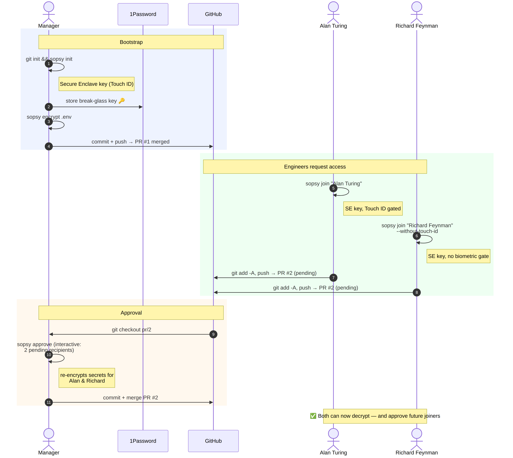
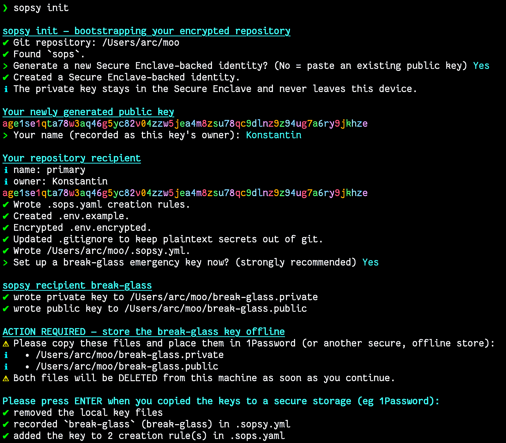
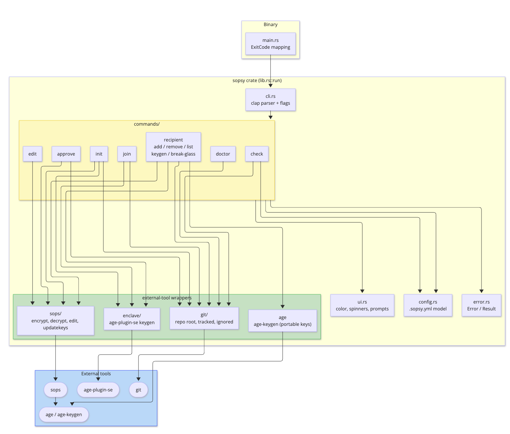
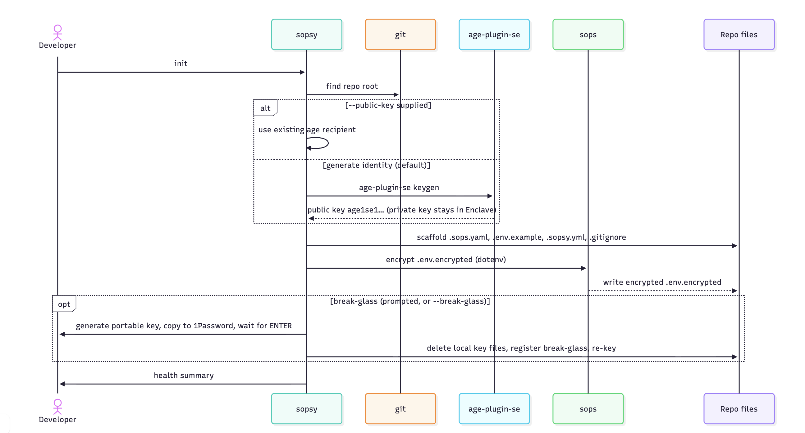
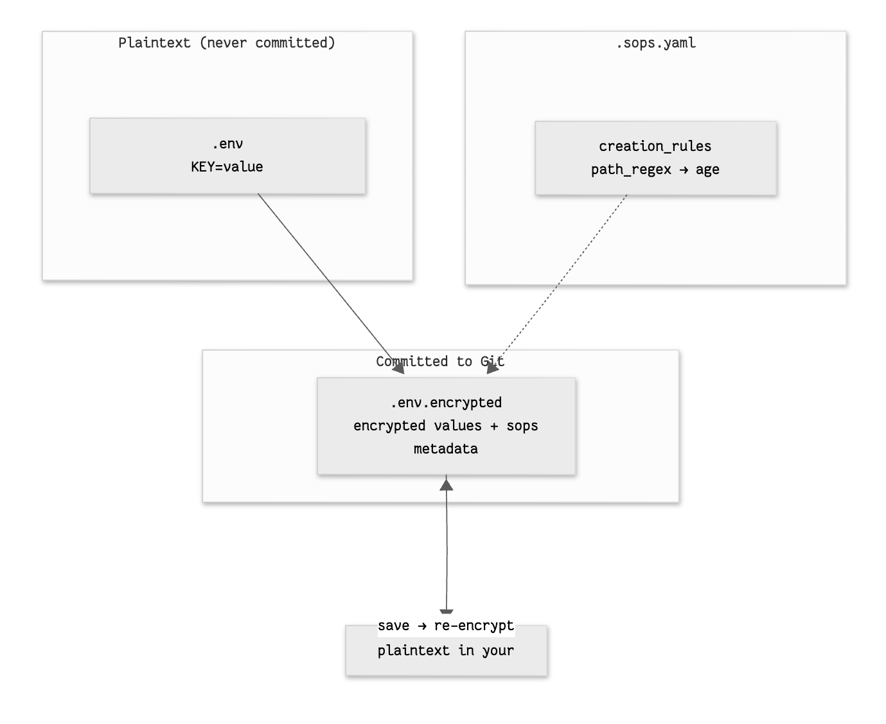
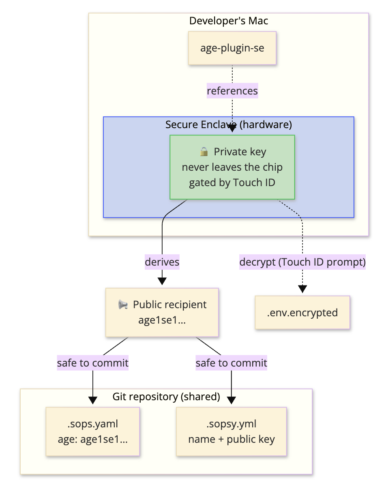
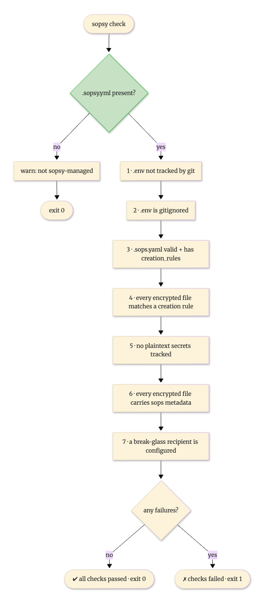

# Sopsy

[](https://crates.io/crates/sopsy) [](https://github.com/kigster/sopsy/actions/workflows/ci.yml) [](https://codecov.io/gh/kigster/sopsy) [](https://github.com/kigster/sopsy)  [](https://docs.rs/crate/sopsy/latest)

> The missing developer experience for [SOPS](https://github.com/getsops/sops).

`sopsy` is a small, fast, colorful Rust CLI that makes it delightful to keep
encrypted secrets in Git. It bootstraps a repository in minutes, generates
hardware-backed identities using the macOS **Secure Enclave**, manages the team's
recipients, and ships a CI gate that fails the build the moment a plaintext
secret sneaks in.

> [!NOTE]
> **sopsy does not replace SOPS. It makes SOPS delightful.**
> SOPS remains the encryption engine; `age` remains the cryptography; the Secure
> Enclave holds the private key. sopsy orchestrates and enhances them with safe
> defaults, great diagnostics, and a scriptable interface.

______________________________________________________________________

## Table of Contents

- [What it is](#what-it-is)
- [Philosophy](#philosophy)
- [Features](#features)
- [Demo](#demo)
- [Encryption & Team Onboarding Flow](#encryption--team-onboarding-flow)
- [Prerequisites](#prerequisites)
- [Install](#install)
- [Quick Start](#quick-start)
- [Screenshot](#screenshot)
- [Architecture](#architecture)
- [How encryption flows](#how-encryption-flows)
- [The Secure Enclave security model](#the-secure-enclave-security-model)
  - [Where your identity lives](#where-your-identity-lives)
  - [Console session, Touch ID, and one-laptop testing](#console-session-touch-id-and-one-laptop-testing)
- [Break-glass keys](#break-glass-keys)
- [Files sopsy manages](#files-sopsy-manages)
- [Command Reference](#command-reference)
  - [Global flags](#global-flags)
  - [`sopsy init`](#sopsy-init)
  - [`sopsy doctor`](#sopsy-doctor)
  - [`sopsy edit`](#sopsy-edit)
  - [`sopsy join`](#sopsy-join)
  - [`sopsy approve`](#sopsy-approve)
  - [`sopsy recipient`](#sopsy-recipient)
  - [`sopsy encrypt` / `sopsy decrypt`](#sopsy-encrypt--sopsy-decrypt)
  - [`sopsy types`](#sopsy-types)
  - [`sopsy check`](#sopsy-check)
  - [`sopsy deps`](#sopsy-deps)
  - [`sopsy completion`](#sopsy-completion)
- [Using sopsy in CI](#using-sopsy-in-ci)
  - [The hygiene gate: `sopsy check` (no keys needed)](#the-hygiene-gate-sopsy-check-no-keys-needed)
  - [Decrypting secrets in CI: setup](#decrypting-secrets-in-ci-setup)
  - [Decrypting secrets in CI: usage](#decrypting-secrets-in-ci-usage)
- [Environment variables](#environment-variables)
- [Scope and roadmap](#scope-and-roadmap)
- [Further reading](#further-reading)

______________________________________________________________________

## What it is

`sopsy` combines **SOPS**, **age**, and **age-plugin-se** into a seamless, hardware-protected way to encrypt application secrets that can be safely committed to a repository. It is built for developer settings and API keys, but works equally well for staging and production secrets.

The killer property: the secret values live in Git in *encrypted* form, while the private key that can decrypt them never leaves your Mac's Secure Enclave.

## Philosophy

- **Sopsy does not replace SOPS** — it orchestrates and enhances it. That keeps the scope crisp and the maintenance burden low.
- **Opinionated, safe defaults** — the right thing should be the easy thing. Plaintext `.env` files are gitignored automatically; a CI gate stops mistakes.
- **Fully scriptable** — every interactive prompt has an equivalent flag, so the same tool serves a human at a terminal and an unattended CI job.
- **Great diagnostics** — `sopsy doctor` produces a report you can paste straight into a GitHub issue.

## Features

- **Secure Enclave-backed identities** — private key bound to the hardware, protected by Touch ID, and impossible to exfiltrate.
- **Repository bootstrap** — one command writes `.sops.yaml`, `.env.example`, an encrypted `.env.encrypted`, `.gitignore` safety rules, and `.sopsy.yml`.
- **`doctor` health checks** — macOS / Apple Silicon / Secure Enclave / Touch ID, the external tools, repo health, and a break-glass reminder.
- **`edit`** — open an encrypted file in your editor through SOPS, with nicer errors and automatic file-type detection (including `dotenv`).
- **Self-service onboarding** — newcomers `sopsy join` to generate a key and request access via a pull request; any active member `sopsy approve`s them.
- **A built-in audit trail** — every member carries their full name, `username`, when they requested access (`requested_at`), and who granted it and when (`approved_by` as `"Konstantin Gredeskoul (kig)"`, `approved_at`). `sopsy recipient list` shows it all in one table.
- **Recipient management** — add, remove, and list the people (and machines) who can decrypt.
- **`encrypt`/`decrypt`** — one-shot encrypt/decrypt of `.env`/YAML/JSON/INI files to stdout (or `-o`), ideal for `direnv` and process wrappers.
- **Break-glass ceremony** — `sopsy recipient break-glass` generates a portable emergency key, hands it off for offline storage, then deletes the local copy.
- **CI decryption ceremony** — `sopsy recipient ci` runs the same guided flow to give your pipeline a portable decryption key: one CI secret (`SOPS_AGE_KEY`) and your workflows can decrypt — [setup guide below](#using-sopsy-in-ci).
- **Config integrity checksum** — `.sopsy.sha` (SHA-256 of `.sopsy.yml` + the admin public key) is refreshed on every write and verified on every read, so hand edits are surfaced instead of silently trusted; `sopsy doctor` repairs it.
- **SOPS key rotation** — every membership change re-wraps the existing secrets via `sops updatekeys`.
- **Safe defaults & a CI gate** — `sopsy check` enforces seven hygiene invariants and exits non-zero on any violation.
- **`--git` staging** — a global flag that `git add`s exactly the files a command changed and prints ready-to-paste commit/push/PR instructions ([details](#global-flags)).
- **Readable, colorful output** — key moments (init complete, members approved, ceremony hand-offs, check failures) render as full-width colored banners; with `--no-color`, pipes, or `NO_COLOR` they degrade to plain bordered boxes so logs stay clean.

## Demo

> [!IMPORTANT]
>
> Watch the demo of sopsy in action in the site's [demo section](https://sopsy-cli.dev/#demo).

______________________________________________________________________

## Encryption & Team Onboarding Flow

Sopsy's killer feature (besides the Touch ID-based decryption) is the fact that each developer on the team must be onboarded to be allowed to decrypt the secrets file. This means that a random person who acquires your repo with all the encrypted files in it can never decrypt the file, since they have not been officially admitted into the select group of decryptors.

The first encryptor is considered the **prime** encryptor, and they are also given the "break-glass" in-case-of-emergency pair of private and public keys to be placed in some exec-only 1Password Vault, because you should hopefully never need those keys unless somehow all of the laptops were stolen from the company.

The next person must request to join with `sopsy join "First Last"` or its synonym `sopsy request-access "Full Name"`.

By default, the key minted in the Apple Enclave will require Touch ID every time it's used. This is good security but may get old if you are using, say, `direnv` or many windows with your project there. If you prefer to trade the security of your thumb for convenience, pass the native `-t` / `--without-touch-id` flag to `sopsy join` (equivalent to forwarding `--access-control none` to `age-plugin-se` after `--`). Here is an example:

```bash
# Alan Turing's MacBook:
git fetch
git checkout main
git checkout -b sopsy/add/alan-turing

# standard request to join, will require Touch ID 
# on every decryption
sopsy request-access "Alan Turing"

# or the alias:
sopsy join "Alan Turing" 

# And in this request to join, private key is still in Enclave, 
# but no Touch ID would be required for decryption
sopsy join "Alan Turing" --without-touch-id
# (equivalent, forwarding the raw age flag)
sopsy join "Alan Turing" -- --access-control none

git add -A .
git commit -m 'Requesting access to the .env.encrypted'
git push origin sopsy/add/alan-turing
# create a PR

# —————————————————————————————————————————————————————————
# Alan's Manager or the "Prime Radiant", or any existing 
# already approved engineer, on their MacBook:
git fetch
git checkout sopsy/add/alan-turing
sopsy approve "Alan Turing"
# or simply like so — this will allow you to interactively
# approve or deny every pending request on that branch.
sopsy approve 
....
git add -A .
git commit -m 'Approving Alan Turing for encryption'
git push

# Either Alan, or the manager or anyone else:
# merges the PR to the main branch. Now they can decrypt the file.
```

To illustrate this process, here is the sequence diagram with not one but two people using the same branch to add themselves for approval (NOTE: to encrypt `.env` you would run `sopsy encrypt .env -o .env.encrypted`).



______________________________________________________________________

## Prerequisites

`sopsy` is **macOS-first** (v1). It orchestrates three external tools, all
installable with [Homebrew](https://brew.sh):

```bash
brew install sops age age-plugin-se
```

> [!TIP]
> If you installed sopsy via `brew install kigster/tap/sopsy`, these are pulled
> in automatically — you can skip this section.

| Tool | Purpose |
| --------------- | ----------------------------------------------------------- |
| `sops` | The encryption engine sopsy drives for every crypto op. |
| `age` | The modern encryption library SOPS uses under the hood. |
| `age-plugin-se` | Generates Secure Enclave-backed `age` identities on macOS. |
| `git` | sopsy is repository-aware (already present on most Macs). |

> [!IMPORTANT]
> Secure Enclave identity generation requires **Apple Silicon** (M-series) with a
> Secure Enclave. On other hardware you can still use sopsy by supplying an
> existing `age` public key (`--public-key`), but you lose hardware protection.

> [!TIP]
> Not sure what's installed? Run `sopsy doctor` — it prints exactly which tools
> were found on your `PATH` and where.

## Install

### Homebrew (recommended)

```bash
brew install kigster/tap/sopsy
```

This is the simplest path: it installs a **prebuilt binary** (no Rust toolchain required) **and** pulls the tools sopsy orchestrates — `sops`, `age`, and, on macOS, `age-plugin-se` — automatically. You can skip the [Prerequisites](#prerequisites) step entirely; Homebrew handles them.

### From crates.io (requires Rust)

```bash
cargo install sopsy
```

You'll still need `sops`, `age`, and `age-plugin-se` on your `PATH` (see [Prerequisites](#prerequisites), or run `sopsy deps`).

### From source

```bash
git clone https://github.com/kigster/sopsy.git
cd sopsy
cargo build --release
# binary at ./target/release/sopsy
```

______________________________________________________________________

## Quick Start

```bash
# 1. Start (or enter) a git repository.
git init my-app && cd my-app

# 2. Bootstrap everything: tools check, Secure Enclave identity, config files.
sopsy init

# 3. Put real secrets in. sopsy decrypts to your editor and re-encrypts on save.
sopsy edit .env.encrypted

# 4. Verify hygiene before you commit (also your CI command).
sopsy check

# 5. Commit the *encrypted* artifacts. Plaintext .env is already gitignored.
git add .sops.yaml .sopsy.yml .sopsy.sha .env.example .env.encrypted .gitignore
git commit -m "Add encrypted secrets managed by sopsy"
```

> [!CAUTION]
> Never `git add .env` or any plaintext secret. `sopsy init` configures
> `.gitignore` to prevent this, and `sopsy check` will fail the build if a
> plaintext secret is ever tracked — but the first line of defense is you.

The `sopsy init` run prints your **public recipient** prominently. That string (an `age1se1...` key) is what your teammates and admins need to grant you access — it is safe to share. The matching **private key never leaves the Secure Enclave**.

> [!TIP]
> **Joining a repo someone else bootstrapped?** Don't run `init`. Run `sopsy join <your-name>` to generate your key and record a pending request, open a pull request, and ask any current member to run `sopsy approve <your-name>`. See the [Member guide](docs/guide-member.md).

## Screenshot

The following is a screenshot from the `sopsy init` session on a MacBook Pro:



______________________________________________________________________

## Architecture

`sopsy` is a thin, well-factored Rust crate: a `clap` CLI dispatches to one module per command, and the commands lean on small helper modules that wrap the external tools. All terminal output and prompting funnels through a single `ui` layer.



| Module | Responsibility |
| --------------- | -------------------------------------------------------------------- |
| `cli.rs` | Authoritative `clap` definition of every command and flag. |
| `ui.rs` | All output and `inquire`-backed prompts; color/TTY/`NO_COLOR` logic. |
| `config.rs` | The serde model for `.sopsy.yml` (members, states, globs, TTL, …). |
| `commands/` | One module per subcommand (`init`, `join`, `approve`, `recipient`, …).|
| `sops/` | Wraps `sops` (`encrypt`, `decrypt`, `edit`, `updatekeys`). |
| `enclave/` | Wraps `age-plugin-se keygen` (Secure Enclave identities). |
| `age.rs` | Wraps `age-keygen` for portable keys (used by break-glass). |
| `git/` | Repo root, tracked files, ignore status, `.gitignore` editing. |
| `error.rs` | `Error`/`Result`; the binary maps any `Err` to a non-zero exit. |

### The `init` bootstrap flow



> [!NOTE]
> `init` is **idempotent**: existing files are preserved unless you pass `--force`. Re-running it is always safe.

> [!TIP]
> In **interactive** mode `init` offers to set up the break-glass key right then — the moment you're most likely to actually do it. It prints a yellow prompt to copy the generated `break-glass.private` / `.public` into 1Password, waits for you, then deletes the local copies. Use `--break-glass` / `--no-break-glass` to decide explicitly (e.g. in scripts).

______________________________________________________________________

## How encryption flows

`sopsy` never touches ciphertext itself — it shells out to `sops`, which uses `age` recipients drawn from `.sops.yaml`'s `creation_rules`. The primary path is the dotenv format: a plaintext `.env` becomes an encrypted `.env.encrypted`.



- **Encrypt** — `sops --encrypt --input-type dotenv --output-type dotenv --in-place .env.encrypted`. The recipients come from `.sops.yaml`.
- **Decrypt / edit** — `sopsy edit` runs `EDITOR=<editor> sops <file>`, which decrypts into a temp file, opens your editor, then re-encrypts on save. This requires a private key one of the recipients holds.
- **File-type detection** — `.env`, `.env.*`, and `*.env` map to `dotenv`; `.yaml`/`.yml` to `yaml`; `.json` to `json`; `.ini` to `ini`; everything else to `binary`.

> [!IMPORTANT]
>
> Only **encrypted** files (`.env.encrypted`, `*.encrypted`, `config/*.encrypted.yaml`) and **public** metadata (`.sops.yaml`, `.sopsy.yml`, `.env.example`) belong in Git. The plaintext `.env` must always stay local.

______________________________________________________________________

## The Secure Enclave security model

Each developer owns an individual key pair. On macOS Apple Silicon the private key is generated *inside* the Secure Enclave and is bound to that hardware — it cannot be read, copied, or exported by anyone or anything. Only the **public recipient** is ever shared or committed.



> [!WARNING]
>
> Because the private key is bound to one device, **losing that device means losing that key**. The repository stays decryptable as long as *another* recipient — a teammate or the break-glass key — can still read it. This is why a break-glass key is mandatory in `sopsy check`.

### Where your identity lives

When `sopsy init` or `sopsy join` generates a Secure Enclave identity, the **identity handle** (`AGE-PLUGIN-SE-1…`) is written to your per-user `sops` age keys file:

| Platform | Location |
| --------------- | ---------------------------------------------------- |
| macOS | `~/Library/Application Support/sops/age/keys.txt` |
| Linux / others | `${XDG_CONFIG_HOME:-~/.config}/sops/age/keys.txt` |

That handle is **not** secret key material — the private key never leaves the Secure Enclave, and the handle only works on *this* device, behind Touch ID — so keeping it on disk is safe. `sops` reads this file automatically (sopsy also points at it explicitly via `SOPS_AGE_KEY_FILE`), and that is what lets `sopsy edit` and `sopsy decrypt` unlock your secrets. Override the path with `SOPSY_KEYS_FILE` if you keep identities elsewhere.

> [!NOTE]
>
> Lose this file and you lose the *reference* to your Enclave key — re-run `sopsy join` (or `init`) to mint a fresh identity and get re-approved. The portable **break-glass** key is the repo-wide safety net.

### Console session, Touch ID, and one-laptop testing

Secure Enclave keys can only be **used to decrypt** from the user's *active GUI login session*. `sudo`, `su`, and SSH cannot raise the Touch ID prompt, so decryption from those contexts fails with `no identity matched any of the recipients` — often with no prompt at all. Encryption and key generation are unaffected (they never touch the private key).

You are prompted for Touch ID on every operation that **decrypts** an encrypted file — `sopsy decrypt`, `sopsy edit`, and `sopsy approve` (once per encrypted file — so approve can prompt more than once). There is no time-based "remember me"; to prompt less often, decrypt once per shell with [direnv](#sopsy-encrypt--sopsy-decrypt).

This matters when simulating a **team on a single Mac** — e.g. exercising the owner → member (`join` / `approve`) flow with two accounts:

- Switch with **Fast User Switching** (log the second account in at the login screen). Do **not** `sudo`/`su` into it — the Enclave won't be reachable.
- Touch ID is enrolled **per macOS account**. The second user must add a fingerprint in *System Settings → Touch ID & Password*, or the default `any-biometry-or-passcode` policy falls back to that account's **login password**.
- Each account has its **own** keystore and its **own** Enclave keys — an identity minted by one user cannot be unwrapped by another. That is the whole point: every member holds a private key only they can use.

> [!NOTE]
>
> Because Enclave identities only work interactively at the console, they are
> useless for CI, automation, and headless/SSH use — which is exactly what the
> portable **break-glass** key (next section) is for.

## Break-glass keys

A **break-glass key** is a separate emergency `age` key pair stored *offline* (for example in 1Password) and shared with only a few admins. It is your disaster-recovery path: if every developer's Secure Enclave device is lost, the break-glass key can still decrypt and re-key the repository. It is a **portable** age key (not Enclave-backed), precisely so it can survive the loss of any device. `sopsy recipient break-glass` runs the whole ceremony — generate, hand off, delete, register — in one command:

```bash
sopsy recipient break-glass -o break-glass
#  1. generates a portable age key pair
#  2. writes break-glass.private and break-glass.public
#  3. prompts you to copy them into 1Password, then WAITS for ENTER
#  4. deletes both local files and registers the key, re-keying every secret
```

> [!CAUTION]
> If you lose your Secure Enclave device **and** have no break-glass key, every
> secret in the repository becomes permanently undecryptable. Set up break-glass
> on day one. `sopsy doctor` and `sopsy check` both nag you until you do, and
> sopsy refuses to remove the *sole* break-glass recipient.

The same guided ceremony — generate a portable key, hand it off, wait for confirmation, delete the local copies, register and re-key — also powers [`sopsy recipient ci`](#recipient-ci), which provisions a decryption key for your CI pipeline instead of an offline vault. The two keys must never be shared: break-glass is offline/few-hands, CI is online/every-run — opposite threat models.

______________________________________________________________________

## Files sopsy manages

| File | Committed? | Purpose |
| ---------------- | ---------- | ------------------------------------------------------------------- |
| `.sops.yaml` | ✅ yes | SOPS `creation_rules`: maps file patterns → `age` recipients. |
| `.sopsy.yml` | ✅ yes | sopsy's own state: member names, usernames, `pending`/`active` state, request/approval provenance (`requested_at`, `approved_at`, `approved_by`), break-glass marker, `join_request_ttl`, sops version. |
| `.sopsy.sha` | ✅ yes | SHA-256 integrity checksum of `.sopsy.yml` (+ the admin public key). Refreshed on every sopsy write, verified on every read; `sopsy doctor` repairs it after a legitimate manual edit. Tamper *evidence*, not proof. |
| `.env.example` | ✅ yes | Placeholder variables; the template for a real `.env`. |
| `.env.encrypted` | ✅ yes | The encrypted secrets (`KEY=ENC[…]` + sops metadata). |
| `.gitignore` | ✅ yes | Updated to ignore plaintext secrets and un-ignore the safe files. |
| `.env` | 🚫 never | Your real plaintext secrets — gitignored, never committed. |

The `.gitignore` rules `sopsy init` ensures are present:

```gitignore
.env
.env.*
!.env.example
!.env.encrypted
*.key
*.pem
```

A minimal generated `.sops.yaml` looks like:

```yaml
# Managed by sopsy. Maps encrypted files to their age recipients.
creation_rules:
  - path_regex: '\.env\.encrypted$'
    age: 'age1se1qg8vw…'
  - path_regex: '\.encrypted$'
    age: 'age1se1qg8vw…'
```

______________________________________________________________________

## Command Reference

The CLI is `clap`-based, so `sopsy --help` and `sopsy <command> --help` are
always authoritative. Every interactive prompt has an equivalent flag.

```
sopsy [GLOBAL FLAGS] <COMMAND> [ARGS]
```

### Global flags

These apply to **every** subcommand (they are global and may appear before or
after the subcommand):

| Flag | Description |
| ----------------------------- | --------------------------------------------------------------------------------------------- |
| `-y`, `--yes`, `--non-interactive` | Disable all prompts; fail with a clear error instead of asking. Auto-enabled when stdout is not a TTY. |
| `--no-color` | Disable colored output. Also honored via the `NO_COLOR` environment variable. |
| `-v`, `--verbose` | Increase verbosity (show debug detail such as the resolved editor and file type). |
| `--git` | After a command changes files, `git add` exactly those files and print ready-to-paste `git commit` / `git push` / `gh pr create` instructions. A no-op for commands that don't modify committed files. |

> [!TIP]
> `--git` saves you from hand-typing the `git add` line that each command
> otherwise suggests. It stages only the specific files sopsy touched (never
> `git add -A`), so it won't sweep up unrelated changes, and it prints a
> commit subject and branch-aware push/PR commands you can paste as-is. It
> works on `init`, `join`, `approve`, `edit`, and every `recipient` mutation.

> [!TIP]
> In CI you don't even need `-y`: when stdout is not a terminal, sopsy detects it
> and refuses to block on prompts automatically. Passing `-y` explicitly is still
> good hygiene and makes intent obvious in scripts.

### `sopsy init`

Bootstrap an encrypted repository. Verifies the toolchain, acquires an `age`
recipient (a generated Secure Enclave identity or a supplied public key), and
writes `.sops.yaml`, `.env.example`, an encrypted `.env.encrypted`, `.gitignore`
safety rules, and `.sopsy.yml`.

| Flag | Description |
| -------------------------- | -------------------------------------------------------------------------------------------- |
| `--recipient-name <NAME>` | Name to record for the recipient created/registered during init (default: `admin`). |
| `--username <NAME>` | Username of who generated the key, recorded in `.sopsy.yml`. When generating interactively, this is the default offered at the prompt (falls back to `$USER`). |
| `--public-key <age1...>` | Use an existing `age` public key instead of generating a new Secure Enclave identity. |
| `--no-generate` | Skip Secure Enclave identity generation. Requires `--public-key`, else init errors. |
| `--break-glass` | Run the break-glass ceremony as part of init (interactive mode prompts by default). |
| `--no-break-glass` | Skip break-glass setup during init (you'll get a reminder to run it later). |
| `--force` | Overwrite/recreate `.sops.yaml` and `.env.encrypted` even if they already exist, and proceed even if some doctor checks fail. |

```bash
# Interactive: generate a Secure Enclave identity (Touch ID may prompt).
sopsy init

# Interactive but name the recipient:
sopsy init --recipient-name alice

# Non-interactive / CI: bring your own age key, never touch the Enclave.
sopsy init -y --recipient-name ci-bot \
  --public-key age1ql3z7hjy54pw3hyww5ayyfg7zqgvc7w3j2elw8zmrj2kg5sfn9aqmcac8p \
  --no-generate
```

> [!IMPORTANT]
> `init` must run inside a git repository — run `git init` first. It is
> idempotent: existing config files are kept unless `--force` is given.

### `sopsy doctor`

Print a colorful, grouped health report and **always exit 0** — it is purely informational and safe to paste into a bug report. Takes no flags.

It reports four groups:

- **System** — macOS version, Apple Silicon, Secure Enclave, Touch ID (macOS only; a neutral "n/a" line elsewhere).
- **Tools** — where `sops`, `age-plugin-se`, and `git` resolve on `PATH`.
- **Repository** — git presence, `.sops.yaml`, `.sopsy.yml` presence and parsing, and the `.sopsy.sha` integrity checksum. A missing or stale checksum is **repaired** here — the doctor's one write — so after a legitimate manual edit of `.sopsy.yml`, run `sopsy doctor` and commit both files.
- **Recipients** — a loud reminder if no break-glass recipient is configured.

```bash
sopsy doctor
```

### `sopsy edit`

Edit an encrypted file with your editor through SOPS — "the missing DX" wrapper
around `EDITOR=<editor> sops <file>`, with friendlier errors and automatic
file-type detection.

| Argument / Flag | Description |
| ---------------------- | -------------------------------------------------------------------------------------- |
| `<file>` | The encrypted file to edit (required). |
| `--editor <EDITOR>` | Editor to use. Overrides `$EDITOR`. Resolution: `--editor` → `$EDITOR` → `$VISUAL` → `vi`. |
| `-- <sops args>` | Everything after `--` is forwarded verbatim to `sops` (can override sopsy's defaults). |

```bash
# Use your $EDITOR (or vi):
sopsy edit .env.encrypted

# Force a specific editor:
sopsy edit .env.encrypted --editor "code --wait"

# Forward extra flags straight to sops:
sopsy edit config/db.encrypted.yaml -- --indent 4
```

> [!NOTE]
> sopsy detects the file type (`dotenv`/`yaml`/`json`/`binary`) and passes
> `--input-type`/`--output-type` to sops, because encrypted file names like
> `.env.encrypted` don't carry an extension sops recognizes. Anything you pass
> after `--` is appended afterward and can override these defaults.

### `sopsy join`

Request membership in a repo someone else bootstrapped. Generates your Secure Enclave identity (or uses `--public-key`) and records a **pending** entry in `.sopsy.yml` with a timestamp. A pending entry is *not* added to `.sops.yaml`, so it grants no access — it is purely a request you then push as a pull request.

| Argument / Flag | Description |
| ------------------------- | -------------------------------------------------------------------------------- |
| `<name>` | Your name as recorded in `.sopsy.yml` — full name or first name (required). |
| `--username <NAME>` | System username recorded alongside the name (defaults to `$USER`). |
| `--public-key <age1...>` | Use an existing public key instead of generating a new Secure Enclave identity. |
| `-t`, `--without-touch-id`| Mint the Enclave identity with no Touch ID / passcode gate (`--access-control none`). |
| `--sopsy-file <FILE>` | Path to the `.sopsy.yml` to update (defaults to the one in the repo root). |
| `-- <age flags>` | Everything after `--` is forwarded to `age-plugin-se keygen`. |

```bash
sopsy join alice                                   # generate a key, record a pending request
sopsy join "Konstantin Gredeskoul" --username kig  # full name + explicit username
sopsy join alice --without-touch-id                # no Touch ID prompt on decryption
sopsy join alice --public-key age1se1…             # reuse an existing public key
# then:
git add .sopsy.yml .sopsy.sha && git commit -m "join: request access for alice" && git push
```

> [!NOTE]
>
> After pushing, open a pull request and ask any active member to run `sopsy approve alice`. Approve promptly — the request expires after the repo's `join_request_ttl` (default 72h); just re-run `sopsy join` to refresh it.

### `sopsy approve`

Approve one or more pending members (run by **any active member**, on their PR branch). Checks each request is fresh, asks you to vouch that the key belongs to the person, adds the key to `.sops.yaml`, flips them to `active`, and runs `sops updatekeys` so every encrypted file gains a stanza they can open. Rolls back atomically if the re-key fails — both config files *and* any already-re-wrapped encrypted files are restored. The approval is recorded in `.sopsy.yml` for the audit trail: `approved_by` (resolved to `"Full Name (username)"` from your `$USER`) and `approved_at`, while `requested_at` is kept — `recipient list` shows all of it.

| Argument / Flag | Description |
| ------------------- | ------------------------------------------------------------------------- |
| `[names]...` | The pending member(s) to approve. Pass several to approve them together and re-key once; with no names, walk every pending member interactively. |
| `--force` | Approve even if a join request is older than `join_request_ttl`. |
| `--no-updatekeys` | Skip the `sops updatekeys` re-encryption step after editing `.sops.yaml`. |

```bash
git fetch origin pull/123/head:join-alice && git switch join-alice
sopsy approve alice                       # vouch, re-key, activate (Touch ID prompts)
sopsy approve annie colin                 # approve several at once, re-keying once
sopsy approve                             # walk every pending request interactively
git add -A && git commit -m "approve: alice" && git push   # then merge the PR
```

> [!WARNING]
>
> Encrypted files do **not** merge. If `.env.encrypted` changes on `main` between your `approve` and the merge, the PR will conflict — rebase onto latest `main` right before approving, and merge promptly. In non-interactive contexts the vouch step requires `SOPSY_ASSUME_YES` (it cannot be left unattended).

### `sopsy recipient`

Manage the repository's recipients. `add`/`remove` keep `.sopsy.yml` and
`.sops.yaml` in sync and then re-wrap the existing encrypted files for the new
recipient set (`sops updatekeys`, per file). `keygen` and `break-glass` are key
generation helpers.

#### `recipient add`

| Argument / Flag | Description |
| ------------------------- | ---------------------------------------------------------------------------- |
| `[name]` | Positional recipient name (equivalent to `--name`). |
| `--name <NAME>` | Recipient name (prompted if omitted in interactive mode). |
| `--public-key <age1...>` | The recipient's `age` public key (prompted if omitted in interactive mode). |
| `--break-glass` | Mark this recipient as the offline emergency break-glass key. |
| `--no-updatekeys` | Skip the `sops updatekeys` re-encryption step after editing `.sops.yaml`. |

```bash
# Interactive: prompts for name + key.
sopsy recipient add

# Non-interactive: add a teammate by positional name.
sopsy recipient add bob --public-key age1se1qg8vw…

# Register the break-glass emergency key.
sopsy recipient add break-glass --public-key age1q… --break-glass
```

> [!WARNING]
>
> `recipient add` rejects duplicate names and duplicate public keys. With `--no-updatekeys`, the config is changed but existing secrets are **not** re-encrypted for the new recipient — they cannot decrypt until you run `sops updatekeys` (or re-add without the flag).

#### `recipient remove`

| Argument / Flag | Description |
| ------------------- | -------------------------------------------------------------------------- |
| `[name]` | Positional recipient name (equivalent to `--name`). |
| `--name <NAME>` | Recipient to remove (a selection prompt is shown if omitted). |
| `--no-updatekeys` | Skip the `sops updatekeys` re-encryption step after editing `.sops.yaml`. |

```bash
sopsy recipient remove alice
sopsy recipient remove --name alice   # equivalent
```

> [!CAUTION]
>
> sopsy refuses to remove the **last remaining recipient** (the repo would become undecryptable) or the **sole break-glass recipient**. Removing a person re-encrypts the secrets so the departed key can no longer read *new* commits — but anyone who already cloned old ciphertext still holds it, so **rotate the underlying secret values too** when offboarding.

#### `recipient list`

Print all configured recipients as a colorful aligned table: name (capped at
21 chars), username (capped at 12), truncated public key, break-glass marker,
and approval provenance (`Konstantin Gredeskoul (kig) on 2026-07-01`; pending
members show `(pending)`). Takes no flags.

```bash
sopsy recipient list
```

#### `recipient keygen`

Generate a fresh Secure Enclave identity and print its public key + identity **without** touching any config (use the printed key with `recipient add`). Trailing args after `--` are forwarded to `age-plugin-se keygen`.

```bash
sopsy recipient keygen
sopsy recipient keygen -- --access-control=any-biometry-or-passcode
```

#### `recipient break-glass`

Generate the offline emergency key in one guided ceremony: write `<output>.private` / `<output>.public`, prompt you to copy them into a secure store, wait for ENTER, then delete the local files and register the key as the break-glass recipient (re-keying every secret).

| Argument / Flag | Description |
| ---------------------- | ------------------------------------------------------------------- |
| `-o, --output <FILE>` | Output prefix; writes `<output>.private` and `<output>.public`. |
| `--name <NAME>` | Recipient name to record (defaults to `break-glass`). |
| `--force` | Overwrite the `.private` / `.public` files if they already exist. |
| `--no-updatekeys` | Skip the `sops updatekeys` re-encryption step. |

```bash
sopsy recipient break-glass -o break-glass
```

> [!IMPORTANT]
> This step is interactive by design (it waits for you to confirm the key is stored
> safely before deleting it). For automation set `SOPSY_ASSUME_YES`, which assumes
> the confirmation — use it only when something else handles secure storage.

#### `recipient ci`

Give your CI pipeline decryption access, in the same guided ceremony as break-glass: generate a **portable** age key (CI runners have no Secure Enclave), write `<output>.private` / `<output>.public`, walk you through storing the key as a CI secret, wait for ENTER, then delete the local files and register the key as an ordinary recipient (re-keying every secret). Only **one** CI secret is needed — `SOPS_AGE_KEY`, holding the *private* half (that's the variable `sops` reads identities from, and sopsy never overrides it). The public half needs no secret: it isn't sensitive, and the ceremony commits it to `.sopsy.yml` / `.sops.yaml` as the recipient.

| Argument / Flag | Description |
| ---------------------- | ------------------------------------------------------------------- |
| `-o, --output <FILE>` | Output prefix (default `ci`); writes `<output>.private` / `<output>.public`. |
| `--name <NAME>` | Recipient name to record (defaults to `ci`). |
| `--force` | Overwrite the `.private` / `.public` files if they already exist. |
| `--no-updatekeys` | Skip the `sops updatekeys` re-encryption step. |

```bash
sopsy recipient ci                                  # ceremony: generate → store → delete → register
gh secret set SOPS_AGE_KEY < ci.private             # (the ceremony prints this for you)
```

A workflow can then decrypt with nothing but `sops` installed — no `age`, no `age-plugin-se`, and it works on Linux runners:

```yaml
- name: Decrypt secrets
  env:
    SOPS_AGE_KEY: ${{ secrets.SOPS_AGE_KEY }}
  run: |
    eval "$(sopsy decrypt .env.encrypted | sed 's/^/export /')"
```

> [!CAUTION]
> The CI key can decrypt **every** sopsy-managed secret, and reading == re-granting.
> Treat a compromised runner like a lost laptop: `sopsy recipient remove ci`, re-run
> `sopsy recipient ci`, and rotate the underlying secret values. Do **not** reuse the
> break-glass key for CI — offline/few-hands and online/every-run are opposite threat
> models. Note that `sopsy check` needs no keys at all; only jobs that consume
> secrets need `SOPS_AGE_KEY`.

### `sopsy encrypt` / `sopsy decrypt`

One-shot encrypt/decrypt of a single file, defaulting to **stdout** so it composes in pipelines. Unlike `edit` (which opens an editor) these are non-interactive and scriptable. The encrypted artifact always ends in `.encrypted`, so the default `.sops.yaml` rule covers it.

> [!NOTE]
>
> These were previously `sopsy secrets encrypt` / `sopsy secrets decrypt`. That `secrets` form still works as a hidden, deprecated alias, but `sopsy encrypt` / `sopsy decrypt` are now the documented commands.

#### `encrypt`

| Argument / Flag | Description |
| ---------------------- | ---------------------------------------------------------------------------- |
| `<file>` | The plaintext file to encrypt (`.env`/`.yaml`/`.json`/`.ini`/…). |
| `-o, --output <FILE>` | Write ciphertext to a file (**must end in `.encrypted`**) instead of stdout. |
| `--type <T>` | Override the format (`dotenv`/`yaml`/`json`/`ini`/`binary`) if the name lacks a usable extension. |

```bash
sopsy encrypt .env -o .env.encrypted        # the committed artifact
sopsy encrypt config.json > config.json.encrypted
```

#### `decrypt`

| Argument / Flag | Description |
| ---------------------- | ----------------------------------------------------------------- |
| `<file>` | The encrypted file to decrypt. |
| `-o, --output <FILE>` | Write plaintext to a file instead of stdout. |
| `--type <T>` | Override the format (rarely needed; inferred from the name). |

```bash
sopsy decrypt .env.encrypted                 # → plaintext on stdout
sopsy decrypt config.json.encrypted -o config.json
```

> [!TIP]
>
> **Load secrets into your shell with `direnv`** — drop this in `.envrc` so the decrypted values live only in memory, only inside the project directory:
>
> ```bash
> eval "$(sopsy decrypt .env.encrypted | sed -E '/^#/d; /^$/d; s/^([A-Z])/export \1/g')"
> ```
>
> The same idea works in a wrapper that `exec`s your app (Rails, etc.) with the secrets in its environment — nothing is ever written to disk in plaintext.

> [!NOTE]
>
> Structured formats (`dotenv`/`yaml`/`json`/`ini`) encrypt **values only**, so keys and structure stay readable and diffable in Git. Everything else is `binary` (the whole file is encrypted as one opaque blob).

### `sopsy types`

Print the file formats sopsy understands (the valid values for `--type`) and which extensions auto-detect to each. Takes no flags. Also available under its longer alias, `sopsy list-supported-types`.

```bash
sopsy types
#   dotenv   .env, .env.*, *.env
#   yaml     .yaml, .yml
#   json     .json
#   ini      .ini
#   binary   anything else (whole-file)
```

### `sopsy check`

The CI gate. Runs seven hygiene invariants over the repository, prints a pass/fail checklist, and **exits non-zero if any invariant fails**. It never needs a decryption key — encrypted files are validated by their on-disk sops metadata, not by decrypting them. Takes no flags.



The seven invariants:

1. `.env` is **not** tracked by git.
1. `.env` **is** gitignored.
1. `.sops.yaml` exists and parses with at least one `creation_rules` entry.
1. Every encrypted file (matching `.sopsy.yml`'s `encrypted_globs`) matches at least one `.sops.yaml` `path_regex`.
1. No plaintext secrets are tracked (`.env`/`.env.*` that isn't `.env.example`/`*.encrypted`, or any `*.key`/`*.pem`).
1. Every encrypted file carries sops metadata (`sops` section + `ENC[`).
1. A break-glass recipient exists in `.sopsy.yml`.

```bash
sopsy check && echo "secrets hygiene: OK"
```

> [!NOTE]
>
> If `.sopsy.yml` is absent, the repository is not sopsy-managed, so `check` prints a notice and exits **0** rather than failing unrelated repositories.

______________________________________________________________________

### `sopsy deps`

Install the external tools sopsy needs (`sops`, `age`, `age-plugin-se`) with [Homebrew](https://brew.sh). It probes for each tool first and only installs the ones that are missing, so it is safe to run repeatedly. This is the *remedy* that pairs with `sopsy doctor`'s *diagnosis*.

| Flag | Effect |
| ----------- | ------------------------------------------------------------ |
| `--check` | Report status only; exit **non-zero** if anything is missing.|
| `--dry-run` | Print the `brew install …` command without running it. |

```bash
sopsy deps              # install whatever is missing
sopsy deps --check      # CI / pre-flight: fail if a dependency is absent
sopsy deps --dry-run    # preview the brew command without touching the system
```

> [!NOTE]
>
> `git` is intentionally **not** installed here — it ships with macOS / the Xcode Command Line Tools. If `brew` itself is missing, `deps` points you to <https://brew.sh>.

> [!TIP]
>
> `sopsy doctor` tells you *what* is missing; `sopsy deps` *fixes* it. For tests and sandboxes, the `brew` binary can be overridden with `SOPSY_BREW_BIN`.

______________________________________________________________________

### `sopsy completion`

Generate a shell completion script. Completions are derived directly from the CLI definition, so they never drift from the real commands and flags. Supports `bash`, `zsh`, `fish`, `powershell`, and `elvish`. The script is written to **stdout**.

```bash
# zsh — write into a directory on your $fpath
sopsy completion zsh > "${fpath[1]}/_sopsy"

# bash — into Homebrew's bash-completion directory
sopsy completion bash > "$(brew --prefix)/etc/bash_completion.d/sopsy"

# fish
sopsy completion fish > ~/.config/fish/completions/sopsy.fish

# …or load it ephemerally from your shell rc
eval "$(sopsy completion zsh)"
```

> [!TIP]
>
> After installing a zsh completion you may need to restart your shell (or run `compinit`) for it to take effect.

______________________________________________________________________

## Using sopsy in CI

CI touches sopsy in two very different ways, with very different key requirements:

1. **The hygiene gate** (`sopsy check`) — validates the repo on every push. Needs **no keys at all**.
1. **Decrypting secrets** (deploys, integration tests) — needs its own recipient, because Secure Enclave keys are hardware-bound to developer Macs and cannot travel to a runner.

### The hygiene gate: `sopsy check` (no keys needed)

`sopsy check` inspects on-disk metadata and never decrypts, so it needs **no private key and no Secure Enclave** — it runs perfectly on a Linux runner. Put it in every pipeline:

```yaml
name: secrets-hygiene
on: [push, pull_request]
jobs:
  check:
    runs-on: macos-latest
    steps:
      - uses: actions/checkout@v4
      - run: brew install sops age age-plugin-se
      - run: cargo install sopsy
      - run: sopsy check          # non-interactive auto-detected; exits 1 on failure
```

…and in a pre-commit hook:

```bash
# .git/hooks/pre-commit
#!/bin/sh
exec sopsy check
```

### Decrypting secrets in CI: setup

One-time setup, performed by **any active member** (someone who can already decrypt):

```bash
# 1. Run the guided ceremony. It generates a portable age key, walks you
#    through storing it as a CI secret, then deletes the local files and
#    registers the key as the `ci` recipient (re-keying every secret).
sopsy recipient ci

# 2. When prompted, add ONE secret to your CI provider — the private half,
#    under the name `sops` actually reads identities from:
gh secret set SOPS_AGE_KEY < ci.private
#    (or GitHub UI: Settings → Secrets and variables → Actions → New repository secret)

# 3. Press ENTER — sopsy deletes ci.private / ci.public locally.
#    The public half needs no secret: it is committed to .sopsy.yml/.sops.yaml
#    as the recipient.

# 4. Commit the registration and the re-wrapped secrets.
git add .sopsy.yml .sopsy.sha .sops.yaml *.encrypted
git commit -m "Add CI recipient"
```

### Decrypting secrets in CI: usage

Only jobs that actually consume secrets need the key. The runner needs just `sops` — no `age`, no `age-plugin-se`, no macOS (the CI identity is a plain portable key, so the Enclave plugin is never invoked):

```yaml
name: deploy
on: [push]
jobs:
  deploy:
    runs-on: ubuntu-latest
    steps:
      - uses: actions/checkout@v4
      - run: |                       # install sops + sopsy for your platform
          SOPS_VERSION=v3.11.0       # pin the release you have tested
          curl -fsSLo /usr/local/bin/sops \
            "https://github.com/getsops/sops/releases/download/${SOPS_VERSION}/sops-${SOPS_VERSION}.linux.amd64"
          chmod +x /usr/local/bin/sops
          cargo install sopsy
      - name: Decrypt secrets
        env:
          SOPS_AGE_KEY: ${{ secrets.SOPS_AGE_KEY }}
        run: |
          # Export into the job environment…
          eval "$(sopsy decrypt .env.encrypted | sed 's/^/export /')"
          # …or materialize a plaintext file for tooling that wants one:
          sopsy decrypt .env.encrypted -o .env
```

> [!CAUTION]
> The CI key can decrypt **every** sopsy-managed secret, and in SOPS reading ==
> re-granting (any recipient holds the data key). Treat a compromised runner like
> a lost laptop: `sopsy recipient remove ci`, re-run `sopsy recipient ci`, and
> rotate the underlying secret **values**. Never reuse the break-glass key for CI —
> offline/few-hands and online/every-run are opposite threat models.

______________________________________________________________________

## Environment variables

| Variable | Effect |
| --------------------------- | ----------------------------------------------------------------------------- |
| `EDITOR` / `VISUAL` | Editor for `sopsy edit` (after `--editor`, before the `vi` default). |
| `NO_COLOR` | Disables colored output (same as `--no-color`). |
| `SOPSY_KEYS_FILE` | Override where sopsy stores/reads the age identity (default: the per-user `sops` keys file). |
| `SOPS_AGE_KEY_FILE` | Standard `sops` var for the age identity file; if you set it, sopsy honors it and stores there. |
| `SOPS_AGE_KEY` | Standard `sops` var holding a literal age identity — how CI decrypts (see [`recipient ci`](#recipient-ci)). sopsy never overrides it. |
| `SOPSY_SOPS_BIN` | Override the `sops` binary path (primarily for testing). |
| `SOPSY_AGE_PLUGIN_SE_BIN` | Override the `age-plugin-se` binary path (primarily for testing). |
| `SOPSY_AGE_KEYGEN_BIN` | Override the `age-keygen` binary path (used by break-glass; for testing). |
| `SOPSY_ASSUME_YES` | Assume interactive confirmations (break-glass press-ENTER, `approve` vouch). For automation/CI only. |

______________________________________________________________________

## Scope and roadmap

`sopsy` is **macOS-first** for v1 — the fastest path to a polished experience (though `sopsy check` and CI decryption via `recipient ci` already work on Linux runners). Deliberately **out of scope** until requested: Linux key generation, TPM, YubiKey, KMS, 1Password/Vault integration, a native-Rust SOPS, and a Ratatui TUI.

## Further reading

- **[Member guide](docs/guide-member.md)** — joining a sopsy-managed repo with `sopsy join`, day-to-day workflow, and troubleshooting.
- **[Owner guide](docs/guide-owner.md)** — bootstrapping, break-glass, the join/approve membership lifecycle, and offboarding.
- Repository: <https://github.com/kigster/sopsy>
- Crate: <https://crates.io/crates/sopsy>
- [SOPS](https://github.com/getsops/sops) ·
  [age](https://github.com/FiloSottile/age) ·
  [age-plugin-se](https://github.com/remko/age-plugin-se)
