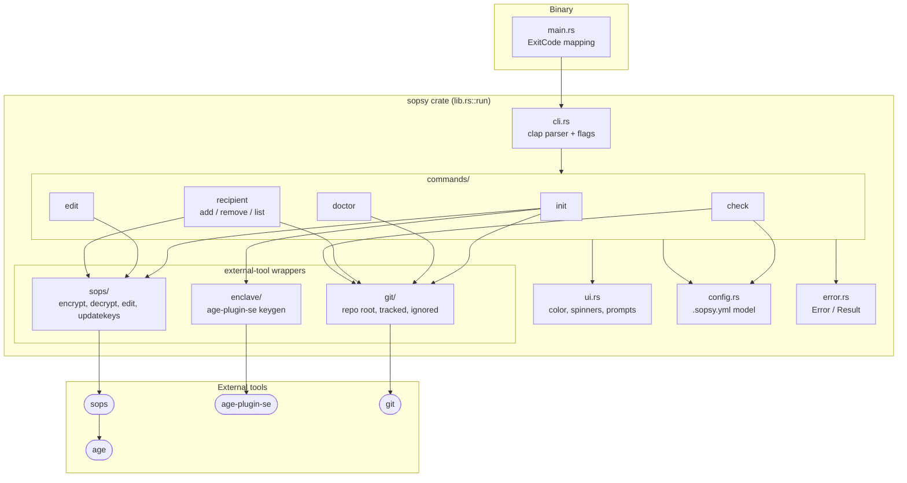
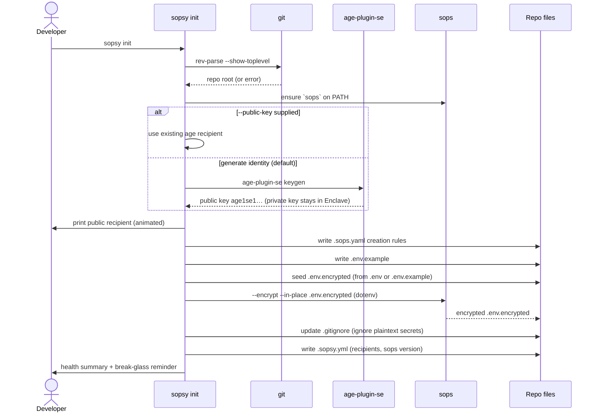
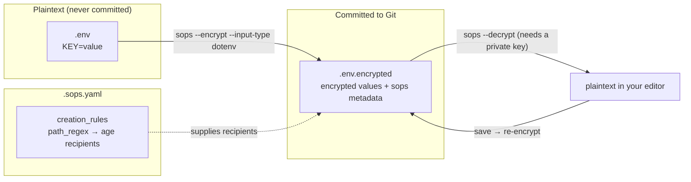
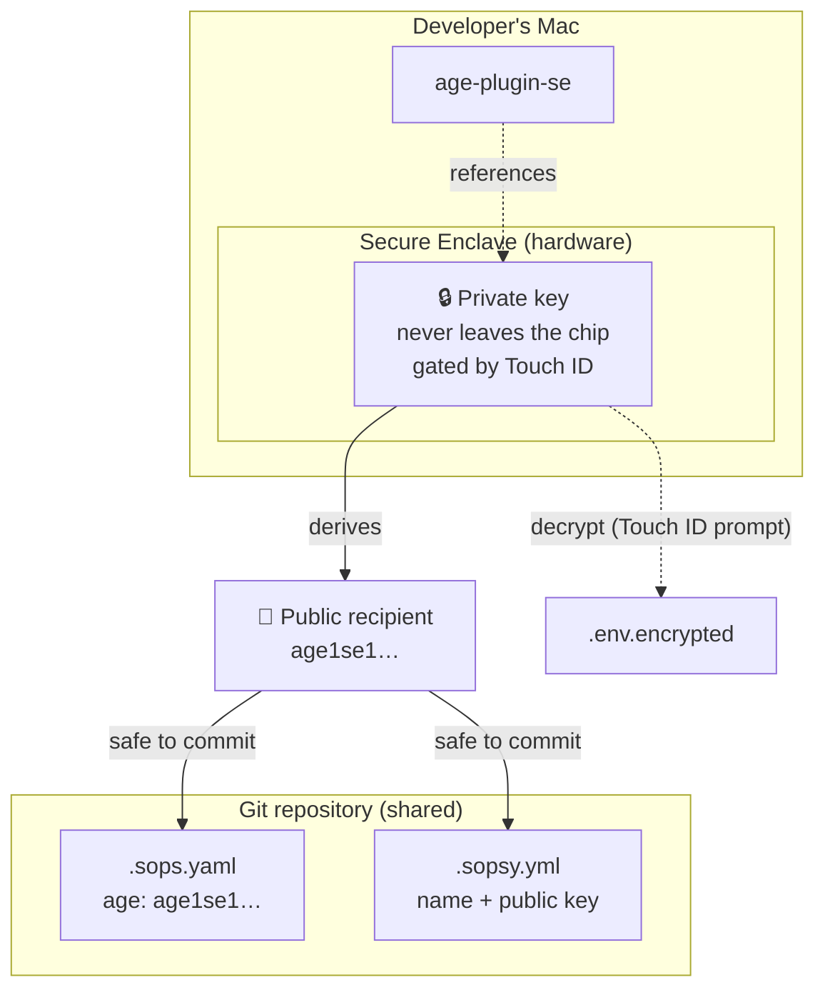
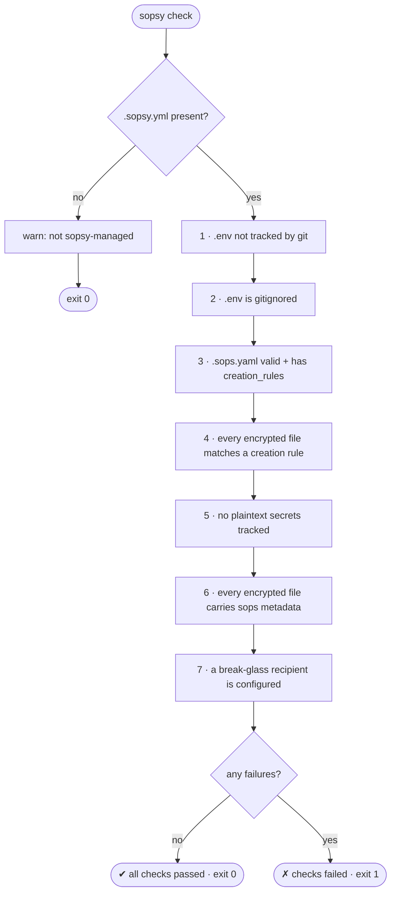

# Sopsy

[](https://crates.io/crates/sopsy)  [](https://github.com/kigster/sopsy/actions/workflows/ci.yml) [](https://codecov.io/gh/kigster/sopsy) [](https://github.com/kigster/sopsy)  [](https://docs.rs/crate/sopsy/latest) 

> The missing developer experience for [SOPS](https://github.com/getsops/sops).

`sopsy` is a small, fast, colorful Rust CLI that makes it delightful to keep
encrypted secrets in Git. It bootstraps a repository in minutes, generates
hardware-backed identities using the macOS **Secure Enclave**, manages the team's
recipients, and ships a CI gate that fails the build the moment a plaintext
secret sneaks in.

> [!NOTE]
> **sopsy does not replace SOPS. It makes SOPS delightful.**
> SOPS remains the encryption engine; `age` remains the cryptography; the Secure
> Enclave holds the private key. sopsy orchestrates and enhances them with safe
> defaults, great diagnostics, and a scriptable interface.

---

## Table of Contents

- [What it is](#what-it-is)
- [Philosophy](#philosophy)
- [Features](#features)
- [Prerequisites](#prerequisites)
- [Install](#install)
- [Quick Start](#quick-start)
- [Architecture](#architecture)
- [How encryption flows](#how-encryption-flows)
- [The Secure Enclave security model](#the-secure-enclave-security-model)
- [Break-glass keys](#break-glass-keys)
- [Files sopsy manages](#files-sopsy-manages)
- [Command Reference](#command-reference)
  - [Global flags](#global-flags)
  - [`sopsy init`](#sopsy-init)
  - [`sopsy doctor`](#sopsy-doctor)
  - [`sopsy edit`](#sopsy-edit)
  - [`sopsy recipient`](#sopsy-recipient)
  - [`sopsy check`](#sopsy-check)
- [Using sopsy in CI](#using-sopsy-in-ci)
- [Environment variables](#environment-variables)
- [Scope and roadmap](#scope-and-roadmap)
- [Further reading](#further-reading)

---

## What it is

`sopsy` combines **SOPS**, **age**, and **age-plugin-se** into a seamless,
hardware-protected way to encrypt application secrets that can be safely
committed to a repository. It is built for developer settings and API keys, but
works equally well for staging and production secrets.

The killer property: the secret values live in Git in *encrypted* form, while
the private key that can decrypt them never leaves your Mac's Secure Enclave.

## Philosophy

- **Sopsy does not replace SOPS** — it orchestrates and enhances it. That keeps
  the scope crisp and the maintenance burden low.
- **Opinionated, safe defaults** — the right thing should be the easy thing.
  Plaintext `.env` files are gitignored automatically; a CI gate stops mistakes.
- **Fully scriptable** — every interactive prompt has an equivalent flag, so the
  same tool serves a human at a terminal and an unattended CI job.
- **Great diagnostics** — `sopsy doctor` produces a report you can paste straight
  into a GitHub issue.

## Features

- 🔐 **Secure Enclave-backed identities** — private key bound to the hardware,
  protected by Touch ID, and impossible to exfiltrate.
- 📦 **Repository bootstrap** — one command writes `.sops.yaml`, `.env.example`,
  an encrypted `.env.encrypted`, `.gitignore` safety rules, and `.sopsy.yml`.
- 🩺 **`doctor` health checks** — macOS / Apple Silicon / Secure Enclave / Touch
  ID, the external tools, repo health, and a break-glass reminder.
- ✏️ **`edit`** — open an encrypted file in your editor through SOPS, with nicer
  errors and automatic file-type detection (including `dotenv`).
- 👥 **Recipient management** — add, remove, and list the people who can decrypt.
- 🔄 **SOPS key rotation** — every recipient change re-wraps the existing secrets
  via `sops updatekeys`.
- 🧪 **Safe defaults & a CI gate** — `sopsy check` enforces seven hygiene
  invariants and exits non-zero on any violation.

---

## Prerequisites

`sopsy` is **macOS-first** (v1). It orchestrates three external tools, all
installable with [Homebrew](https://brew.sh):

```bash
brew install sops age age-plugin-se
```

| Tool            | Purpose                                                      |
| --------------- | ----------------------------------------------------------- |
| `sops`          | The encryption engine sopsy drives for every crypto op.     |
| `age`           | The modern encryption library SOPS uses under the hood.     |
| `age-plugin-se` | Generates Secure Enclave-backed `age` identities on macOS.  |
| `git`           | sopsy is repository-aware (already present on most Macs).    |

> [!IMPORTANT]
> Secure Enclave identity generation requires **Apple Silicon** (M-series) with a
> Secure Enclave. On other hardware you can still use sopsy by supplying an
> existing `age` public key (`--public-key`), but you lose hardware protection.

> [!TIP]
> Not sure what's installed? Run `sopsy doctor` — it prints exactly which tools
> were found on your `PATH` and where.

## Install

From [crates.io](https://crates.io/crates/sopsy):

```bash
cargo install sopsy
```

Or build from source:

```bash
git clone https://github.com/kigster/sopsy.git
cd sopsy
cargo build --release
# binary at ./target/release/sopsy
```

---

## Quick Start

```bash
# 1. Start (or enter) a git repository.
git init my-app && cd my-app

# 2. Bootstrap everything: tools check, Secure Enclave identity, config files.
sopsy init

# 3. Put real secrets in. sopsy decrypts to your editor and re-encrypts on save.
sopsy edit .env.encrypted

# 4. Verify hygiene before you commit (also your CI command).
sopsy check

# 5. Commit the *encrypted* artifacts. Plaintext .env is already gitignored.
git add .sops.yaml .sopsy.yml .env.example .env.encrypted .gitignore
git commit -m "Add encrypted secrets managed by sopsy"
```

> [!CAUTION]
> Never `git add .env` or any plaintext secret. `sopsy init` configures
> `.gitignore` to prevent this, and `sopsy check` will fail the build if a
> plaintext secret is ever tracked — but the first line of defense is you.

The `sopsy init` run prints your **public recipient** prominently. That string
(an `age1se1...` key) is what your teammates and admins need to grant you
access — it is safe to share. The matching **private key never leaves the Secure
Enclave**.

---

## Architecture

`sopsy` is a thin, well-factored Rust crate: a `clap` CLI dispatches to one
module per command, and the commands lean on small helper modules that wrap the
external tools. All terminal output and prompting funnels through a single `ui`
layer.



| Module          | Responsibility                                                        |
| --------------- | -------------------------------------------------------------------- |
| `cli.rs`        | Authoritative `clap` definition of every command and flag.           |
| `ui.rs`         | All output and `inquire`-backed prompts; color/TTY/`NO_COLOR` logic. |
| `config.rs`     | The serde model for `.sopsy.yml` (recipients, globs, sops version).  |
| `commands/`     | One module per subcommand (`init`, `doctor`, `edit`, …).             |
| `sops/`         | Wraps `sops` (`encrypt`, `decrypt`, `edit`, `updatekeys`).           |
| `enclave/`      | Wraps `age-plugin-se keygen` and parses its output.                  |
| `git/`          | Repo root, tracked files, ignore status, `.gitignore` editing.       |
| `error.rs`      | `Error`/`Result`; the binary maps any `Err` to a non-zero exit.      |

### The `init` bootstrap flow



> [!NOTE]
> `init` is **idempotent**: existing files are preserved unless you pass
> `--force`. Re-running it is always safe.

---

## How encryption flows

sopsy never touches ciphertext itself — it shells out to `sops`, which uses
`age` recipients drawn from `.sops.yaml`'s `creation_rules`. The primary path is
the dotenv format: a plaintext `.env` becomes an encrypted `.env.encrypted`.



- **Encrypt** — `sops --encrypt --input-type dotenv --output-type dotenv
  --in-place .env.encrypted`. The recipients come from `.sops.yaml`.
- **Decrypt / edit** — `sopsy edit` runs `EDITOR=<editor> sops <file>`, which
  decrypts into a temp file, opens your editor, then re-encrypts on save. This
  requires a private key one of the recipients holds.
- **File-type detection** — `.env`, `.env.*`, and `*.env` map to `dotenv`;
  `.yaml`/`.yml` to `yaml`; `.json` to `json`; everything else to `binary`.

> [!IMPORTANT]
> Only **encrypted** files (`.env.encrypted`, `*.encrypted`,
> `config/*.encrypted.yaml`) and **public** metadata (`.sops.yaml`, `.sopsy.yml`,
> `.env.example`) belong in Git. The plaintext `.env` must always stay local.

---

## The Secure Enclave security model

Each developer owns an individual key pair. On macOS Apple Silicon the private
key is generated *inside* the Secure Enclave and is bound to that hardware — it
cannot be read, copied, or exported by anyone or anything. Only the **public
recipient** is ever shared or committed.



> [!WARNING]
> Because the private key is bound to one device, **losing that device means
> losing that key**. The repository stays decryptable as long as *another*
> recipient — a teammate or the break-glass key — can still read it. This is why
> a break-glass key is mandatory in `sopsy check`.

## Break-glass keys

A **break-glass key** is a separate emergency `age` key pair stored *offline*
(for example in 1Password) and shared with only a few admins. It is your
disaster-recovery path: if every developer's Secure Enclave device is lost, the
break-glass key can still decrypt and re-key the repository.

```bash
# 1. Generate an emergency key pair OFFLINE (a normal age key, not Enclave-backed):
age-keygen -o break-glass.key
#   public key: age1q...   <-- register this; store break-glass.key in a vault

# 2. Register it as the break-glass recipient (re-encrypts existing secrets):
sopsy recipient add break-glass --public-key age1q... --break-glass
```

> [!CAUTION]
> If you lose your Secure Enclave device **and** have no break-glass key, every
> secret in the repository becomes permanently undecryptable. Set up break-glass
> on day one. `sopsy doctor` and `sopsy check` both nag you until you do, and
> sopsy refuses to remove the *sole* break-glass recipient.

---

## Files sopsy manages

| File             | Committed? | Purpose                                                              |
| ---------------- | ---------- | ------------------------------------------------------------------- |
| `.sops.yaml`     | ✅ yes     | SOPS `creation_rules`: maps file patterns → `age` recipients.       |
| `.sopsy.yml`     | ✅ yes     | sopsy's own state: recipient names, break-glass marker, sops version. |
| `.env.example`   | ✅ yes     | Placeholder variables; the template for a real `.env`.              |
| `.env.encrypted` | ✅ yes     | The encrypted secrets (`KEY=ENC[…]` + sops metadata).               |
| `.gitignore`     | ✅ yes     | Updated to ignore plaintext secrets and un-ignore the safe files.   |
| `.env`           | 🚫 never   | Your real plaintext secrets — gitignored, never committed.          |

The `.gitignore` rules `sopsy init` ensures are present:

```gitignore
.env
.env.*
!.env.example
!.env.encrypted
*.key
*.pem
```

A minimal generated `.sops.yaml` looks like:

```yaml
# Managed by sopsy. Maps encrypted files to their age recipients.
creation_rules:
  - path_regex: '\.env\.encrypted$'
    age: 'age1se1qg8vw…'
  - path_regex: '\.encrypted$'
    age: 'age1se1qg8vw…'
```

---

## Command Reference

The CLI is `clap`-based, so `sopsy --help` and `sopsy <command> --help` are
always authoritative. Every interactive prompt has an equivalent flag.

```
sopsy [GLOBAL FLAGS] <COMMAND> [ARGS]
```

### Global flags

These apply to **every** subcommand (they are global and may appear before or
after the subcommand):

| Flag                          | Description                                                                                   |
| ----------------------------- | --------------------------------------------------------------------------------------------- |
| `-y`, `--yes`, `--non-interactive` | Disable all prompts; fail with a clear error instead of asking. Auto-enabled when stdout is not a TTY. |
| `--no-color`                  | Disable colored output. Also honored via the `NO_COLOR` environment variable.                 |
| `-v`, `--verbose`             | Increase verbosity (show debug detail such as the resolved editor and file type).             |

> [!TIP]
> In CI you don't even need `-y`: when stdout is not a terminal, sopsy detects it
> and refuses to block on prompts automatically. Passing `-y` explicitly is still
> good hygiene and makes intent obvious in scripts.

### `sopsy init`

Bootstrap an encrypted repository. Verifies the toolchain, acquires an `age`
recipient (a generated Secure Enclave identity or a supplied public key), and
writes `.sops.yaml`, `.env.example`, an encrypted `.env.encrypted`, `.gitignore`
safety rules, and `.sopsy.yml`.

| Flag                       | Description                                                                                  |
| -------------------------- | -------------------------------------------------------------------------------------------- |
| `--recipient-name <NAME>`  | Name to record for the recipient created/registered during init (default: `primary`).        |
| `--public-key <age1...>`   | Use an existing `age` public key instead of generating a new Secure Enclave identity.        |
| `--no-generate`            | Skip Secure Enclave identity generation. Requires `--public-key`, else init errors.          |
| `--force`                  | Overwrite/recreate `.sops.yaml` and `.env.encrypted` even if they already exist.             |

```bash
# Interactive: generate a Secure Enclave identity (Touch ID may prompt).
sopsy init

# Interactive but name the recipient:
sopsy init --recipient-name alice

# Non-interactive / CI: bring your own age key, never touch the Enclave.
sopsy init -y --recipient-name ci-bot \
  --public-key age1ql3z7hjy54pw3hyww5ayyfg7zqgvc7w3j2elw8zmrj2kg5sfn9aqmcac8p \
  --no-generate
```

> [!IMPORTANT]
> `init` must run inside a git repository — run `git init` first. It is
> idempotent: existing config files are kept unless `--force` is given.

### `sopsy doctor`

Print a colorful, grouped health report and **always exit 0** — it is purely
informational and safe to paste into a bug report. Takes no flags.

It reports four groups:

- **System** — macOS version, Apple Silicon, Secure Enclave, Touch ID (macOS
  only; a neutral "n/a" line elsewhere).
- **Tools** — where `sops`, `age-plugin-se`, and `git` resolve on `PATH`.
- **Repository** — git presence, `.sops.yaml`, `.sopsy.yml` presence and parsing.
- **Recipients** — a loud reminder if no break-glass recipient is configured.

```bash
sopsy doctor
```

### `sopsy edit`

Edit an encrypted file with your editor through SOPS — "the missing DX" wrapper
around `EDITOR=<editor> sops <file>`, with friendlier errors and automatic
file-type detection.

| Argument / Flag        | Description                                                                            |
| ---------------------- | -------------------------------------------------------------------------------------- |
| `<file>`               | The encrypted file to edit (required).                                                 |
| `--editor <EDITOR>`    | Editor to use. Overrides `$EDITOR`. Resolution: `--editor` → `$EDITOR` → `$VISUAL` → `vi`. |
| `-- <sops args>`       | Everything after `--` is forwarded verbatim to `sops` (can override sopsy's defaults). |

```bash
# Use your $EDITOR (or vi):
sopsy edit .env.encrypted

# Force a specific editor:
sopsy edit .env.encrypted --editor "code --wait"

# Forward extra flags straight to sops:
sopsy edit config/db.encrypted.yaml -- --indent 4
```

> [!NOTE]
> sopsy detects the file type (`dotenv`/`yaml`/`json`/`binary`) and passes
> `--input-type`/`--output-type` to sops, because encrypted file names like
> `.env.encrypted` don't carry an extension sops recognizes. Anything you pass
> after `--` is appended afterward and can override these defaults.

### `sopsy recipient`

Manage the repository's recipients. `add`/`remove` keep `.sopsy.yml` and
`.sops.yaml` in sync and then re-wrap the existing encrypted files for the new
recipient set (`sops updatekeys`, per file).

#### `recipient add`

| Argument / Flag           | Description                                                                  |
| ------------------------- | ---------------------------------------------------------------------------- |
| `[name]`                  | Positional recipient name (equivalent to `--name`).                          |
| `--name <NAME>`           | Recipient name (prompted if omitted in interactive mode).                    |
| `--public-key <age1...>`  | The recipient's `age` public key (prompted if omitted in interactive mode).  |
| `--break-glass`           | Mark this recipient as the offline emergency break-glass key.                |
| `--no-updatekeys`         | Skip the `sops updatekeys` re-encryption step after editing `.sops.yaml`.    |

```bash
# Interactive: prompts for name + key.
sopsy recipient add

# Non-interactive: add a teammate by positional name.
sopsy recipient add bob --public-key age1se1qg8vw…

# Register the break-glass emergency key.
sopsy recipient add break-glass --public-key age1q… --break-glass
```

> [!WARNING]
> `recipient add` rejects duplicate names and duplicate public keys. With
> `--no-updatekeys`, the config is changed but existing secrets are **not**
> re-encrypted for the new recipient — they cannot decrypt until you run
> `sops updatekeys` (or re-add without the flag).

#### `recipient remove`

| Argument / Flag     | Description                                                                |
| ------------------- | -------------------------------------------------------------------------- |
| `[name]`            | Positional recipient name (equivalent to `--name`).                       |
| `--name <NAME>`     | Recipient to remove (a multi-select prompt is shown if omitted).          |
| `--no-updatekeys`   | Skip the `sops updatekeys` re-encryption step after editing `.sops.yaml`. |

```bash
sopsy recipient remove alice
sopsy recipient remove --name alice   # equivalent
```

> [!CAUTION]
> sopsy refuses to remove the **last remaining recipient** (the repo would
> become undecryptable) or the **sole break-glass recipient**. Removing a person
> re-encrypts the secrets so the departed key can no longer read *new* commits —
> but anyone who already cloned old ciphertext still holds it, so **rotate the
> underlying secret values too** when offboarding.

#### `recipient list`

Print all configured recipients as a colorful aligned table (name, truncated
public key, break-glass marker). Takes no flags.

```bash
sopsy recipient list
```

### `sopsy check`

The CI gate. Runs seven hygiene invariants over the repository, prints a
pass/fail checklist, and **exits non-zero if any invariant fails**. It never
needs a decryption key — encrypted files are validated by their on-disk sops
metadata, not by decrypting them. Takes no flags.



The seven invariants:

1. `.env` is **not** tracked by git.
2. `.env` **is** gitignored.
3. `.sops.yaml` exists and parses with at least one `creation_rules` entry.
4. Every encrypted file (matching `.sopsy.yml`'s `encrypted_globs`) matches at
   least one `.sops.yaml` `path_regex`.
5. No plaintext secrets are tracked (`.env`/`.env.*` that isn't
   `.env.example`/`*.encrypted`, or any `*.key`/`*.pem`).
6. Every encrypted file carries sops metadata (`sops` section + `ENC[`).
7. A break-glass recipient exists in `.sopsy.yml`.

```bash
sopsy check && echo "secrets hygiene: OK"
```

> [!NOTE]
> If `.sopsy.yml` is absent, the repository is not sopsy-managed, so `check`
> prints a notice and exits **0** rather than failing unrelated repositories.

---

## Using sopsy in CI

`sopsy check` is the one command you want in CI and in a pre-commit hook.

### GitHub Actions

```yaml
name: secrets-hygiene
on: [push, pull_request]
jobs:
  check:
    runs-on: macos-latest
    steps:
      - uses: actions/checkout@v4
      - run: brew install sops age age-plugin-se
      - run: cargo install sopsy
      - run: sopsy check          # non-interactive auto-detected; exits 1 on failure
```

### Pre-commit hook

```bash
# .git/hooks/pre-commit
#!/bin/sh
exec sopsy check
```

> [!TIP]
> `sopsy check` only inspects on-disk metadata and never decrypts, so it needs
> **no private key and no Secure Enclave** — it runs perfectly on a Linux CI
> runner too. Pass `-y` to be explicit about non-interactive intent.

---

## Environment variables

| Variable                    | Effect                                                                        |
| --------------------------- | ----------------------------------------------------------------------------- |
| `EDITOR` / `VISUAL`         | Editor for `sopsy edit` (after `--editor`, before the `vi` default).          |
| `NO_COLOR`                  | Disables colored output (same as `--no-color`).                               |
| `SOPSY_SOPS_BIN`            | Override the `sops` binary path (primarily for testing).                      |
| `SOPSY_AGE_PLUGIN_SE_BIN`   | Override the `age-plugin-se` binary path (primarily for testing).             |

---

## Scope and roadmap

`sopsy` is **macOS-first** for v1 — the fastest path to a polished experience.
Deliberately **out of scope** until requested: Linux, TPM, YubiKey, KMS,
1Password/Vault integration, GitHub Actions helpers, a native-Rust SOPS, and a
Ratatui TUI.

## Further reading

- 📘 **[Developer guide](docs/guide-developer.md)** — joining a sopsy-managed
  repo, registering your key, day-to-day workflow, and troubleshooting.
- 🛠️ **[Admin guide](docs/guide-admin.md)** — onboarding/offboarding, the
  recipient lifecycle, and break-glass procedures for maintainers.
- 🔗 Repository: <https://github.com/kigster/sopsy>
- 🔗 Crate: <https://crates.io/crates/sopsy>
- 🔗 [SOPS](https://github.com/getsops/sops) ·
  [age](https://github.com/FiloSottile/age) ·
  [age-plugin-se](https://github.com/remko/age-plugin-se)
</content>
</invoke>
