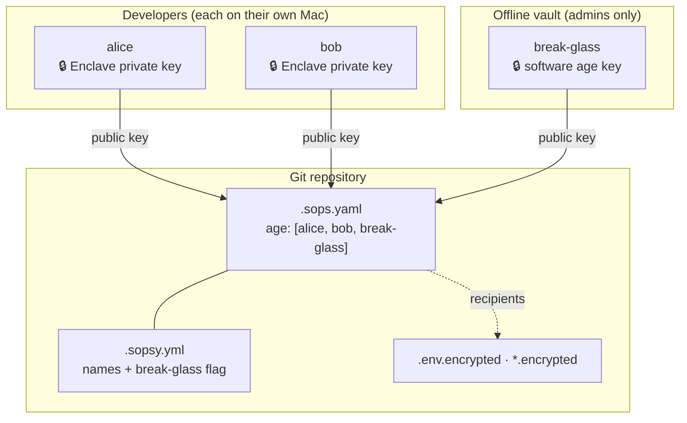
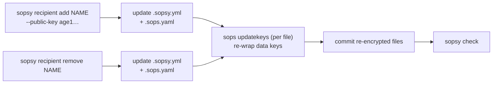
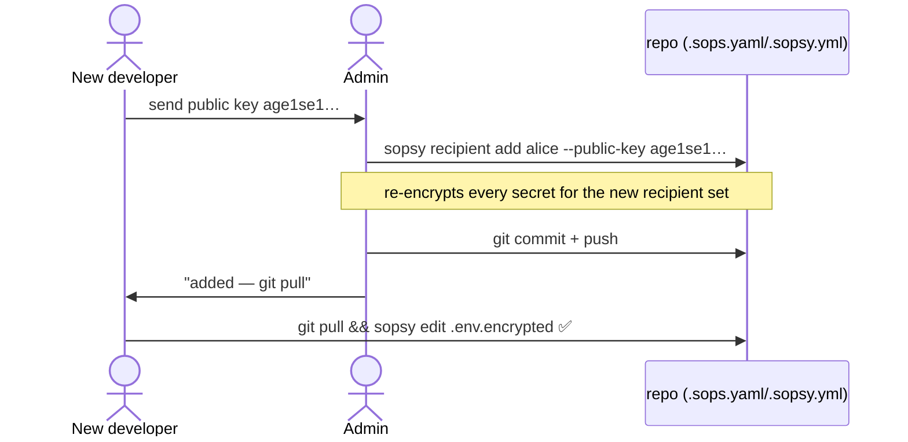
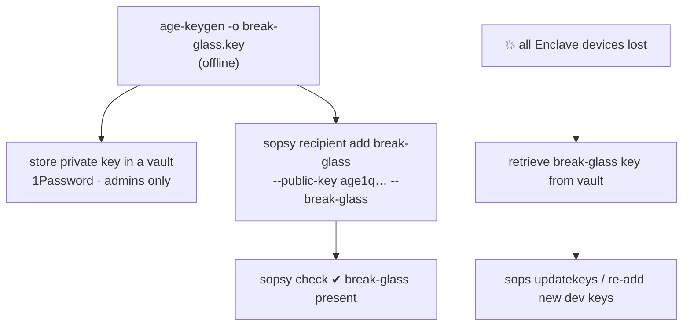

# Sopsy — The Missing Developer Encryptor

## Secrets Management Guide (Engineering Manager / Admin)

This guide is for the person who **owns** a sopsy-managed repository: you
bootstrap it, onboard and offboard developers, and keep the break-glass key
safe. For the day-to-day developer perspective, see the
[Developer guide](guide-developer.md); for the full command reference, the
[README](../README.md).

> [!NOTE]
> sopsy does not replace SOPS — it makes SOPS delightful. Everything below is
> ultimately `sops` + `age`; sopsy adds safe defaults, a CI gate, and the
> recipient bookkeeping that humans get wrong.

### Overview

This repository stores shared development secrets in Git in **encrypted form** using:

- SOPS
- age encryption

No plaintext secrets should ever be committed.

Only developers possessing an approved age private key can decrypt repository secrets.

> [!IMPORTANT]
> Plaintext secrets must **never** be committed. `sopsy init` configures
> `.gitignore` to keep them out, and `sopsy check` fails CI if one slips in — but
> as the admin you own the policy. Treat any leaked plaintext as a rotation event.

---

## Security Model

Each developer owns an individual key pair.

On macOS it is generated by the [Secure Enclave](https://support.apple.com/guide/security/the-secure-enclave-sec59b0b31ff/web), which subsequently holds the private key, and makes it entirely inaccessible to anyone or anything.

```txt
Developer

Private Key  → stays on developer laptop's Enclave
Public Key   → shared with repository maintainers
```

Only public keys are checked into the repository.



The repository contains:

```txt
.sops.yaml
.sopsy.yml
.env.example
.env.encrypted
config/*.encrypted.yaml
```

The repository never contains:

```txt
.env
.env.production
*.pem
*.key
AWS credentials
API keys
```

> [!NOTE]
> sopsy keeps **two** config files in sync. `.sops.yaml` is consumed by `sops`
> itself (the `creation_rules` / `age` recipient lists). `.sopsy.yml` is sopsy's
> own richer metadata: human-readable recipient names, the break-glass marker,
> the encrypted-file globs, and the `sops` version. The `sopsy recipient`
> commands update both for you.

---

## Bootstrapping the repository

As the admin you run `sopsy init` **once** to set everything up:

```bash
cd my-repo
sopsy init                       # generates a Secure Enclave identity for you
# or, in CI / on non-Enclave hardware:
sopsy init -y --recipient-name ci --public-key age1… --no-generate
```

This writes `.sops.yaml`, `.env.example`, an encrypted `.env.encrypted`, the
`.gitignore` safety rules, and `.sopsy.yml`, then prints your public recipient.

> [!TIP]
> `init` is idempotent — re-running it preserves existing files unless you pass
> `--force`. Run `sopsy doctor` afterward to confirm the toolchain and repo are
> healthy, and set up the break-glass key right away (see below).

---

## Initial Setup (per developer)

Each developer generates their own key pair. On macOS Apple Silicon, prefer a
Secure Enclave identity:

```bash
age-plugin-se keygen --access-control=any-biometry-or-passcode -o ~/sopsy-identity.txt
# public key: age1se1xxxxxxxxxxxxxxxxxxxxxxxxxx
```

A software key also works (no hardware protection):

```bash
age-keygen -o ~/.config/sops/age/keys.txt
# public key: age1xxxxxxxxxxxxxxxxxxxxxxxxxxxx
```

They send only their **public key**.

---

## The recipient lifecycle

Every membership change follows the same shape: edit the recipient set, then
`sops updatekeys` re-wraps every encrypted file's data key for the new set.
`sopsy recipient add` / `remove` do both steps for you.



> [!WARNING]
> Use `--no-updatekeys` only when you intend to batch several changes and run the
> re-encryption yourself afterward. Until `sops updatekeys` runs, a newly added
> recipient **cannot decrypt** existing secrets, and a removed recipient's key is
> still embedded in the ciphertext.

---

## Onboarding a Developer



1. Obtain the developer's **public key**.
2. Add them (updates both config files and re-encrypts):

   ```bash
   sopsy recipient add alice --public-key age1se1...
   ```

3. Commit the result and tell them to `git pull`.

The equivalent manual edit to `.sops.yaml` is shown below for reference, but
prefer the `sopsy recipient` command so `.sopsy.yml` stays in sync:

```yaml
creation_rules:
  - path_regex: '\.encrypted$'
    age:
      - age1alice...
      - age1bob...
      - age1charlie...
```

```bash
# Manual re-encryption (what sopsy runs for you, per file):
sops updatekeys -y --input-type dotenv .env.encrypted
```

Commit the result.

> [!TIP]
> `sopsy recipient list` prints the current roster (names, truncated keys, and
> the ★ break-glass marker) — a quick way to confirm an add or audit access.

---

## Offboarding a Developer

```bash
sopsy recipient remove alice
```

This removes alice from both config files and re-encrypts so her key is no
longer a recipient of **future** ciphertext.

> [!CAUTION]
> Removing a recipient does **not** retroactively protect secrets she already
> cloned — she still holds old ciphertext and her key decrypted it. When someone
> leaves with access to sensitive values, **rotate the underlying secrets**
> (database passwords, API keys) in addition to removing the recipient.
>
> sopsy also refuses to remove the **last remaining recipient** or the **sole
> break-glass recipient**, to avoid stranding the repository.

---

## Break-glass: disaster recovery

A break-glass key is a separate emergency `age` key pair, stored **offline**
(e.g. 1Password) and known to only a few admins. It is the recovery path if
every developer's Secure Enclave device is lost.



```bash
# 1. Generate the emergency pair OFFLINE:
age-keygen -o break-glass.key          # prints: public key: age1q...
# 2. Store break-glass.key in the vault; register the PUBLIC key:
sopsy recipient add break-glass --public-key age1q... --break-glass
```

> [!CAUTION]
> Without a break-glass key, losing the Secure Enclave devices that hold the only
> recipient keys means **permanent, unrecoverable loss** of every secret. Set up
> break-glass on day one. Both `sopsy doctor` and `sopsy check` warn/fail until a
> break-glass recipient exists.

> [!IMPORTANT]
> The break-glass *private* key must live offline in a vault, never in the
> repository and never on a developer's daily-driver machine. Only its public
> key (`age1q…`) is committed — exactly like any other recipient.

---

## Enforcing hygiene in CI

Run `sopsy check` in CI and as a pre-commit hook. It validates seven invariants
(plaintext not tracked, `.env` ignored, `.sops.yaml` valid, every encrypted file
covered and genuinely encrypted, no plaintext secrets tracked, break-glass
present) and exits non-zero on any failure — **without needing any private key**.
See the [CI gate diagram and YAML example in the README](../README.md#using-sopsy-in-ci).

> [!TIP]
> Because `check` never decrypts, it runs on a Linux CI runner just fine. The
> Secure Enclave is only needed to *create* keys and *edit* secrets, not to
> verify hygiene.
