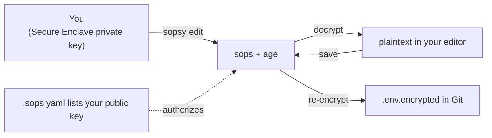
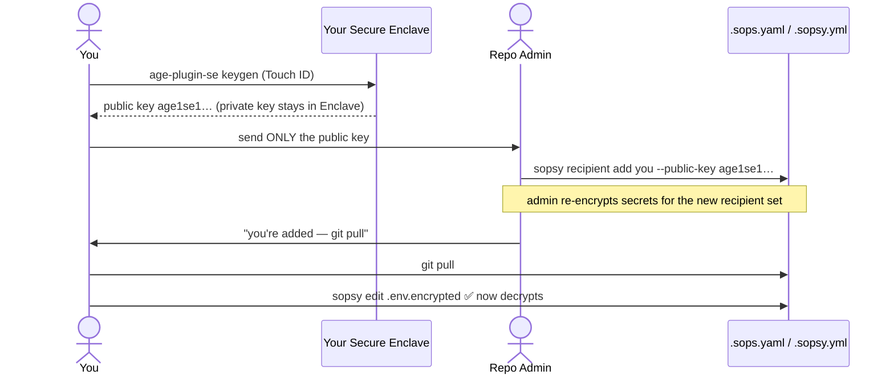
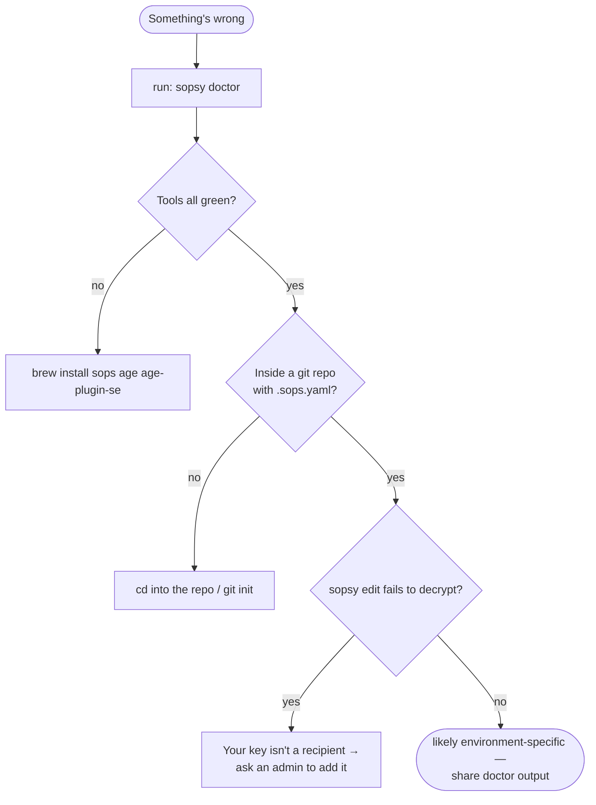

# Sopsy — Developer Guide

You just cloned a repository whose secrets are managed by `sopsy`. This guide
gets you from "I can't read `.env.encrypted`" to "I edit secrets every day
without thinking about it."

> [!NOTE]
> sopsy does not replace SOPS — it wraps it. Everything here ultimately runs
> `sops` + `age`; sopsy just makes the workflow pleasant and hard to get wrong.
> For the full command/flag reference, see the [README](../README.md).

## Table of Contents

- [Mental model in 30 seconds](#mental-model-in-30-seconds)
- [One-time setup](#one-time-setup)
- [Getting access (register your key)](#getting-access-register-your-key)
- [Day-to-day workflow](#day-to-day-workflow)
- [Before you commit](#before-you-commit)
- [Troubleshooting with `sopsy doctor`](#troubleshooting-with-sopsy-doctor)
- [FAQ](#faq)

---

## Mental model in 30 seconds

- Secrets live in Git **encrypted** (`.env.encrypted`, `*.encrypted`).
- You can decrypt them only if your **public key** is listed as a recipient in
  `.sops.yaml`, because the matching **private key** lives in *your* Secure
  Enclave.
- Your private key never leaves your Mac. You only ever share your public key.
- Plaintext `.env` is gitignored and must never be committed.



## One-time setup

Install the toolchain and sopsy (macOS):

```bash
brew install sops age age-plugin-se
cargo install sopsy
```

Confirm your machine is ready:

```bash
sopsy doctor
```

> [!TIP]
> You want green checks for `sops`, `age-plugin-se`, and `git` under **Tools**,
> and (on Apple Silicon) "Secure Enclave available" under **System**. If
> something is red, fix that first — every other command depends on it.

## Getting access (register your key)

Until your public key is in `.sops.yaml`, you cannot decrypt anything. Here is
the onboarding handshake between you and a repository admin:



### Generate your key pair

If you don't already have a Secure Enclave identity:

```bash
age-plugin-se keygen --access-control=any-biometry-or-passcode -o ~/sopsy-identity.txt
# The file prints a line like:  # public key: age1se1q...
```

> [!IMPORTANT]
> Send your admin **only the public key** (`age1se1…`). Never share the identity
> file or anything labelled `AGE-PLUGIN-SE-…` — that's the private material.
> (With Secure Enclave keys the secret never actually leaves the chip, but treat
> the identity stanza as sensitive regardless.)

> [!NOTE]
> No Apple Silicon / Secure Enclave? You can still participate with a software
> `age` key (`age-keygen -o ~/.config/sops/age/keys.txt`) and hand the admin that
> public key — you just don't get hardware protection. Point `SOPS_AGE_KEY_FILE`
> at your key file so `sops` can find it.

Once the admin confirms you've been added, `git pull` and you're in.

## Day-to-day workflow

```bash
git pull                        # get the latest encrypted secrets
sopsy edit .env.encrypted       # decrypt → edit → re-encrypt on save
sopsy check                     # confirm hygiene before committing
git add .env.encrypted
git commit -m "Update API keys"
git push
```

- **`sopsy edit <file>`** decrypts into a temp file, opens your `$EDITOR` (or
  `--editor`), and re-encrypts when you save and quit. A Touch ID prompt may
  appear — that's the Secure Enclave releasing your key for this operation.
- To read a value without editing, use `sops` directly:
  `sops --decrypt --input-type dotenv .env.encrypted`.
- New encrypted file? Name it so it matches a `.sops.yaml` rule (e.g.
  `something.encrypted` or `config/db.encrypted.yaml`) and run
  `sops --encrypt --in-place …`, or ask an admin.

> [!WARNING]
> Never copy a decrypted value into a tracked file, and never `git add .env`.
> The plaintext `.env` is for your machine only. If you need a real local `.env`,
> generate it from the encrypted source:
> `sops --decrypt --input-type dotenv .env.encrypted > .env`.

## Before you commit

Always run the same gate CI will run:

```bash
sopsy check
```

It verifies, among other things, that `.env` isn't tracked, that every encrypted
file is genuinely encrypted, and that a break-glass key exists. A non-zero exit
means **do not commit** until it's green. See the
[CI gate diagram in the README](../README.md#sopsy-check) for the full list of
the seven invariants.

> [!TIP]
> Wire it into a pre-commit hook so you never forget:
> ```bash
> echo 'exec sopsy check' > .git/hooks/pre-commit && chmod +x .git/hooks/pre-commit
> ```

## Troubleshooting with `sopsy doctor`

`sopsy doctor` is your first stop for anything weird. It never fails and is safe
to paste into a Slack thread or GitHub issue.



| Symptom                                            | Likely cause & fix                                                             |
| -------------------------------------------------- | ----------------------------------------------------------------------------- |
| `sops` / `age-plugin-se` not found on PATH         | `brew install sops age age-plugin-se`, then re-open your shell.               |
| `edit` fails: *no matching creation rules*         | The file name doesn't match a `.sops.yaml` `path_regex`. Rename or ask admin. |
| `edit` fails to decrypt (no key)                   | Your public key isn't in `.sops.yaml` yet — ask an admin to add you.          |
| Touch ID never prompts / decrypt hangs             | Enclave/Touch ID not enrolled. Check `sopsy doctor` **System** group.         |
| `not inside a git repository`                      | Run commands from within the cloned repo (or `git init`).                     |
| `.sopsy.yml not found — run sopsy init`            | The repo wasn't bootstrapped with sopsy; an admin should run `sopsy init`.    |

## FAQ

**Do I ever run `sopsy init`?** Usually no — that's a one-time admin action to
bootstrap the repo. You join an already-initialized repo.

**Can I use VS Code?** Yes: `sopsy edit .env.encrypted --editor "code --wait"`
(the `--wait` is essential so sops knows when you've finished editing).

**I rotated/lost my Mac.** Generate a fresh Secure Enclave key on the new
machine and have an admin add it (and remove the old one). Your old device's key
can no longer decrypt new commits once removed.

> [!CAUTION]
> If your Mac is the *only* recipient and it dies without a break-glass key in
> place, the secrets are gone for good. Make sure your team has a break-glass key
> — `sopsy check` fails until one exists precisely to prevent this.
</content>
