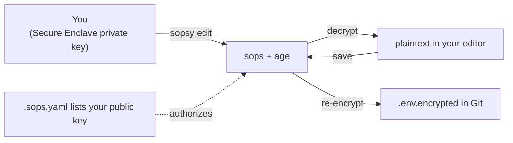
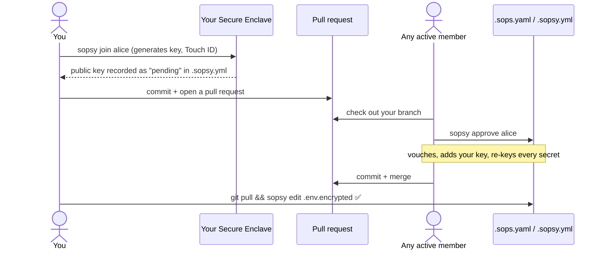
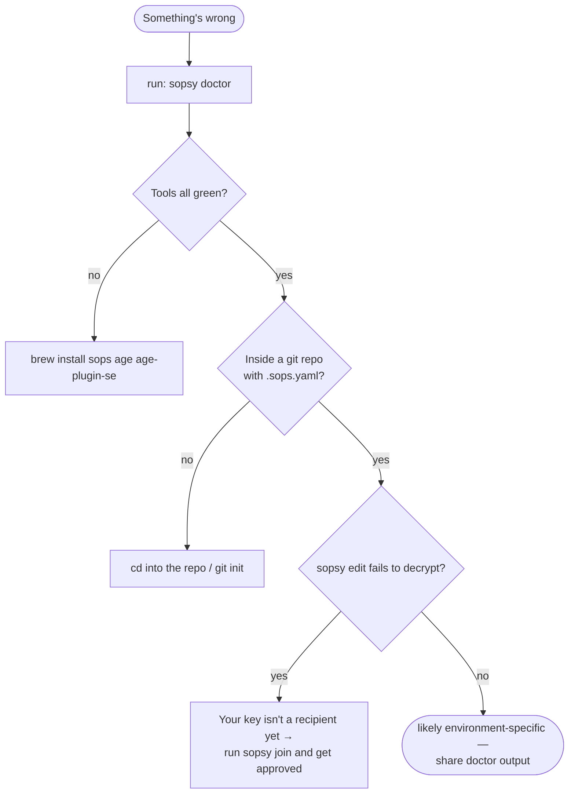

# Sopsy — Member Guide

You just cloned a repository whose secrets are managed by `sopsy`. This guide gets
you from "I can't read `.env.encrypted`" to "I edit secrets every day without
thinking about it."

> [!NOTE]
> sopsy does not replace SOPS — it wraps it. Everything here ultimately runs
> `sops` + `age`; sopsy just makes the workflow pleasant and hard to get wrong.
> For the full command/flag reference, see the [README](../README.md).

## Table of Contents

- [Mental model in 30 seconds](#mental-model-in-30-seconds)
- [One-time setup](#one-time-setup)
- [Getting access with `sopsy join`](#getting-access-with-sopsy-join)
- [Day-to-day workflow](#day-to-day-workflow)
- [Before you commit](#before-you-commit)
- [Troubleshooting with `sopsy doctor`](#troubleshooting-with-sopsy-doctor)
- [FAQ](#faq)

______________________________________________________________________

## Mental model in 30 seconds

- Secrets live in Git **encrypted** (`.env.encrypted`, `*.encrypted`).
- You can decrypt them only once your **public key** is listed as a recipient in
  `.sops.yaml`, because the matching **private key** lives in *your* Secure Enclave.
- Your private key never leaves your Mac. You only ever share your public key.
- Plaintext `.env` is gitignored and must never be committed.



## One-time setup

Install the toolchain and sopsy (macOS):

```bash
# Simplest:
brew install kigster/tap/sopsy

# Requires Rust toolchain
cargo install sopsy
sopsy deps # installs additional binaries
```

Confirm your machine is ready:

```bash
sopsy doctor
```

> [!TIP]
> You want green checks for `sops`, `age-plugin-se`, and `git` under **Tools**, and
> (on Apple Silicon) "Secure Enclave available" under **System**. If something is
> red, fix that first — every other command depends on it.

## Getting access with `sopsy join`

Onboarding is **self-service**: you generate your own key and open a pull request;
any existing member approves you. You never have to email anyone your key or wait on
one specific busy person.



### Step 1 — request access

From inside the cloned repo:

```bash
sopsy join alice          # use your own handle instead of "alice"
```

This generates your Secure Enclave identity (Touch ID may prompt; the private key
never leaves the chip), shows your public key, and records a **pending** entry in
`.sopsy.yml` with a timestamp. A pending entry is *not* in `.sops.yaml`, so it
grants nothing yet — it is purely a request.

> [!TIP]
> Already have a Secure Enclave public key? Skip generation with
> `sopsy join alice --public-key age1se1…`.

> [!TIP]
> Tired of Touch ID on every decrypt (e.g. when using `direnv`)? Pass
> `-t` / `--without-touch-id` to mint the Enclave key with no biometric or
> passcode gate (`age-plugin-se --access-control none`). The private key still
> never leaves the Enclave and is device-bound — it just stops prompting. Drop
> the flag if you want the biometric protection.

### Step 2 — open a pull request

```bash
git add .sopsy.yml .sopsy.sha
git commit -m "join: request access for alice"
git push           # then open a PR, and ping any member to approve you
```

> [!TIP]
> Add `--git` to the `sopsy join` above and sopsy stages `.sopsy.yml` and its
> `.sopsy.sha` sidecar for you, then prints the exact `git commit` / `git push`
> commands to paste — no need to remember which files to add.

### Step 3 — get approved

Any active member checks out your branch and runs `sopsy approve alice`. That adds
your key to `.sops.yaml`, re-keys every encrypted file so your key can open it, and
flips you to `active`. They commit and merge.

> [!IMPORTANT]
> Approve promptly: your request expires after the repo's `join_request_ttl`
> (default 72h). If it goes stale, the approver can pass `--force`
> (`sopsy approve alice --force`), or remove the pending entry and re-run
> `sopsy join` — sopsy refuses to overwrite an existing request.

Once it's merged, `git pull` and you're in.

> [!NOTE]
> No Apple Silicon / Secure Enclave? You can still participate with a software `age`
> key (`age-keygen -o ~/.config/sops/age/keys.txt`) and pass that public key to
> `sopsy join alice --public-key age1…` — you just don't get hardware protection.
> Point `SOPS_AGE_KEY_FILE` at your key file so `sops` can find it.

## Day-to-day workflow

```bash
git pull                        # get the latest encrypted secrets
sopsy edit .env.encrypted       # decrypt → edit → re-encrypt on save
sopsy check                     # confirm hygiene before committing
git add .env.encrypted
git commit -m "Update API keys"
git push
```

> [!TIP]
> `sopsy edit .env.encrypted --git` stages just the re-encrypted file and
> prints the commit/push commands for you, so you can skip the manual
> `git add` above.

- **`sopsy edit <file>`** decrypts into a temp file, opens your `$EDITOR` (or
  `--editor`), and re-encrypts when you save and quit. A Touch ID prompt may appear
  — that's the Secure Enclave releasing your key for this operation.
- To read a value without editing, use `sopsy decrypt`:
  `sopsy decrypt .env.encrypted` (plaintext goes to stdout; the file type is
  auto-detected from the name).
- New encrypted file? Run
  `sopsy encrypt config/db.yaml -o config/db.yaml.encrypted` — the output must
  end in `.encrypted` so it matches a `.sops.yaml` rule — or ask a teammate.

> [!WARNING]
> Never copy a decrypted value into a tracked file, and never `git add .env`.
> The plaintext `.env` is for your machine only. If you need a real local `.env`,
> generate it from the encrypted source:
> `sopsy decrypt .env.encrypted > .env`.

## Before you commit

Always run the same gate CI will run:

```bash
sopsy check
```

It verifies, among other things, that `.env` isn't tracked, that every encrypted
file is genuinely encrypted, and that a break-glass key exists. A non-zero exit
means **do not commit** until it's green. See the
[CI gate diagram in the README](../README.md#sopsy-check) for the full list of the
seven invariants.

> [!TIP]
> Wire it into a pre-commit hook so you never forget:
>
> ```bash
> echo 'exec sopsy check' > .git/hooks/pre-commit && chmod +x .git/hooks/pre-commit
> ```

## Troubleshooting with `sopsy doctor`

`sopsy doctor` is your first stop for anything weird. It never fails and is safe to
paste into a Slack thread or GitHub issue.



| Symptom | Likely cause & fix |
| -------------------------------------------------- | ----------------------------------------------------------------------------- |
| `sops` / `age-plugin-se` not found on PATH | `brew install sops age age-plugin-se`, then re-open your shell. |
| `edit` fails: *no matching creation rules* | The file name doesn't match a `.sops.yaml` `path_regex`. Rename or ask. |
| `edit` fails to decrypt (no key) | Your key isn't in `.sops.yaml` yet — run `sopsy join` and get approved. |
| Touch ID never prompts / decrypt hangs | Enclave/Touch ID not enrolled. Check `sopsy doctor` **System** group. |
| `not inside a git repository` | Run commands from within the cloned repo (or `git init`). |
| `.sopsy.yml not found — run sopsy init` | The repo wasn't bootstrapped with sopsy; the owner should run `sopsy init`. |

## FAQ

**Do I ever run `sopsy init`?** No — that's the one-time owner action that
bootstraps the repo. You join an already-initialized repo with `sopsy join`.

**Can I approve other people?** Yes. Any *active* member can run `sopsy approve` —
the cryptography only requires that you can already decrypt. Vouch carefully: you're
confirming the key really belongs to that person.

**Can I use VS Code?** Yes: `sopsy edit .env.encrypted --editor "code --wait"`
(the `--wait` is essential so sops knows when you've finished editing).

**I rotated/lost my Mac.** Have a teammate `sopsy recipient remove` your old entry
first (`sopsy join` refuses a name that is already registered), then run
`sopsy join` on the new machine to request a fresh key and get approved. Your old
device's key can no longer decrypt new commits once removed.

> [!CAUTION]
> If your Mac is the *only* recipient and it dies without a break-glass key in
> place, the secrets are gone for good. Make sure your team has a break-glass key —
> `sopsy check` fails until one exists precisely to prevent this.
