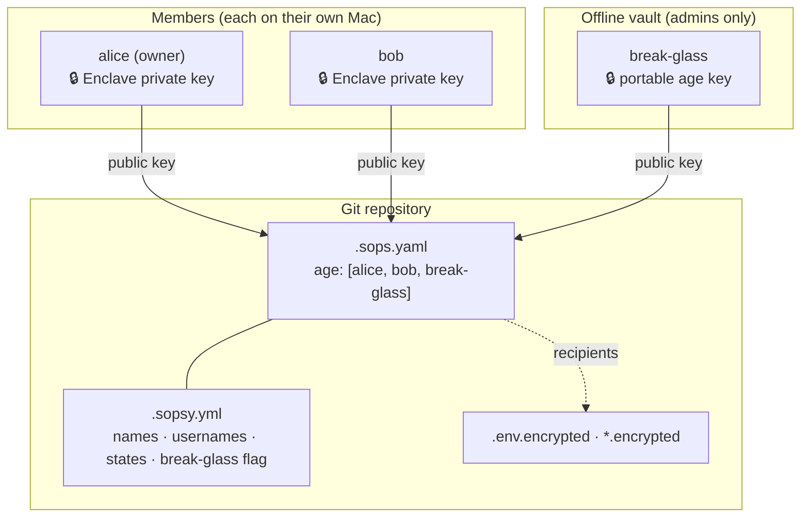
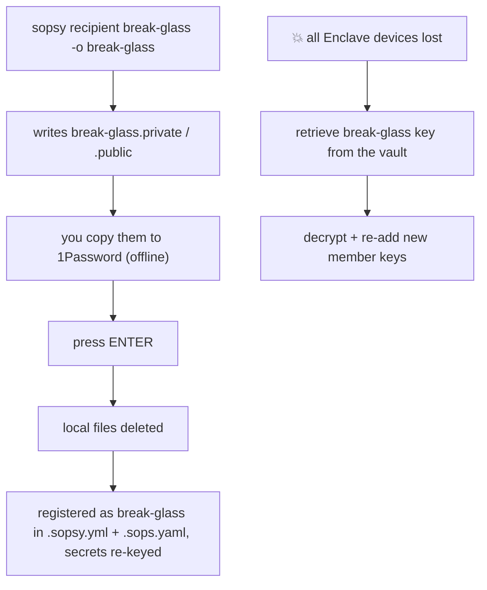
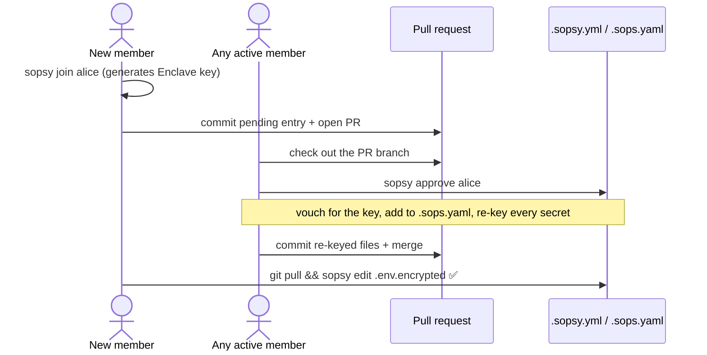

# Sopsy — Owner Guide

## Secrets Management Guide (Repository Owner)

This guide is for the **owner** of a sopsy-managed repository: the first person to
run `sopsy init`. You bootstrap the repo, create the break-glass key, and approve
the members who join. For the member's day-to-day perspective, see the
[Member guide](guide-member.md); for the full command reference, the
[README](../README.md).

> [!NOTE]
> sopsy does not replace SOPS — it makes SOPS delightful. Everything below is
> ultimately `sops` + `age`; sopsy adds safe defaults, a CI gate, and the
> membership bookkeeping that humans get wrong.

### Who is the "owner"?

The owner is simply the first member — the person who runs `sopsy init`. There is
**no cryptographic super-power** attached to the role: in this model every active
member can decrypt, and therefore every active member can also approve new members
(re-keying requires only that you can already decrypt). "Owner" is a convention
recorded in `.sopsy.yml` (via `--username`), not an enforced permission.

> [!IMPORTANT]
> Roles in `.sopsy.yml` are **soft guardrails, not access control.** sopsy is
> serverless — it edits files committed to Git. Anyone with repo write access and a
> text editor can change `.sops.yaml`; the cryptography only guarantees that they
> cannot read *existing* secrets unless they were already a recipient. Enforce
> *who may change membership* with branch protection / CODEOWNERS on `.sops.yaml`
> and `.sopsy.yml` — that is where an actual authority (the server) lives.

---

## Security Model

Each member owns an individual key pair. On macOS Apple Silicon the private key is
generated *inside* the [Secure Enclave](https://support.apple.com/guide/security/the-secure-enclave-sec59b0b31ff/web)
and bound to that hardware — it cannot be read, copied, or exported. Only the
**public key** is ever shared or committed.

```txt
Member

Private Key  → stays on the member's laptop, inside the Secure Enclave
Public Key   → committed to the repository (safe to share)
```



> [!NOTE]
> sopsy keeps **two** files in sync. `.sops.yaml` is consumed by `sops` itself (the
> `creation_rules` / `age` recipient lists). `.sopsy.yml` is sopsy's own richer
> metadata: member names, the `username` of who generated each key, the lifecycle
> **state** (`active`/`pending`), the break-glass marker, the encrypted-file globs,
> the `join_request_ttl`, and the `sops` version.

---

## Bootstrapping the repository

As the owner you run `sopsy init` **once**:

```bash
cd my-repo
sopsy init                       # generates a Secure Enclave identity for you
# or, in CI / on non-Enclave hardware:
sopsy init -y --recipient-name ci --public-key age1… --no-generate
```

When it generates a new identity, `init` shows the public key, pauses so you can
take it in, and asks for your **name** (defaulting to your system username) — this
is recorded as the key's `username` in `.sopsy.yml`, so it is obvious later who
generated it. It then writes `.sops.yaml`, `.env.example`, an encrypted
`.env.encrypted`, the `.gitignore` safety rules, and `.sopsy.yml`.

> [!TIP]
> Add `--git` to `sopsy init` and it `git add`s exactly the files it just
> created (`.sops.yaml`, `.env.example`, `.env.encrypted`, `.gitignore`,
> `.sopsy.yml`, and its `.sopsy.sha` sidecar), then prints ready-to-paste
> `git commit` / `git push` / `gh pr create` commands. It never runs
> `git add -A`, so unrelated changes stay out of your first commit.

In **interactive** mode, `init` then offers to set up the break-glass key right
away (it prompts; pass `--break-glass` / `--no-break-glass` to decide explicitly).
Accepting runs the same ceremony described in the next section. This is the best
moment to do it — don't skip it.

> [!TIP]
> `init` is idempotent — re-running it preserves existing files unless you pass
> `--force`. Run `sopsy doctor` afterward to confirm the toolchain and repo are
> healthy.

---

## Break-glass: do this on day one

A **break-glass key** is a separate emergency `age` key pair — a *portable* key,
**not** a Secure Enclave one, because it must survive the loss of any single
device. It is stored offline (e.g. in 1Password) and is your recovery path if every
member's Enclave device is lost.

`sopsy recipient break-glass` runs the whole ceremony for you:

```bash
sopsy recipient break-glass -o break-glass
```

This:

1. generates a portable age key pair,
2. writes `break-glass.private` and `break-glass.public` to disk,
3. tells you to copy them into 1Password (or another offline vault) and **waits**,
4. once you press ENTER, **deletes both local files** and registers the key as the
   break-glass recipient — adding it to `.sops.yaml` and re-keying every secret.



> [!CAUTION]
> Without a break-glass key, losing the Enclave devices that hold the only
> recipient keys means **permanent, unrecoverable loss** of every secret. Both
> `sopsy doctor` and `sopsy check` warn/fail until a break-glass recipient exists,
> and sopsy refuses to remove the *sole* break-glass recipient.

> [!IMPORTANT]
> The break-glass *private* key must live offline in a vault — never in the repo,
> never on a daily-driver machine. Only its public key is committed, exactly like
> any other recipient.

---

## The membership lifecycle (join → approve)

Onboarding is **member-driven**: the newcomer generates their own key and opens a
pull request adding themselves as `pending`; any active member approves. This means
you — the busy owner — are no longer a bottleneck, and you never have to chase
anyone for a key or hand-type one.



### What `approve` actually does

`sopsy approve <name>`:

1. **checks freshness** — refuses requests older than `join_request_ttl`
   (default `72h`, editable in `.sopsy.yml`) unless you pass `--force`;
2. **asks you to vouch** — shows the name + public key so you confirm, out of band,
   that the key really belongs to that person (the one human trust step no
   cryptography can remove);
3. **adds the key to `.sops.yaml`** and flips the member from `pending` to `active`;
4. **runs `sops updatekeys`** on every encrypted file — this adds a wrapped copy of
   the data key for the new member. It does **not** re-encrypt the file bodies, and
   it requires *your* key to unwrap the data key first (Touch ID will prompt).

If the re-key fails (e.g. you cannot decrypt), every change is rolled back so the
repo is never left inconsistent — both the config files **and** any encrypted
body already re-wrapped are restored to their exact pre-command bytes.

> [!TIP]
> Run `sopsy approve alice --git` to stage the full membership file set it
> touched (`.sops.yaml`, `.sopsy.yml`, `.sopsy.sha`, and every re-keyed
> encrypted file) and print the commit/push commands — the same convenience is
> available on every `recipient add` / `remove` / `break-glass` / `ci`.

> [!WARNING]
> Encrypted files do **not** merge. Approve late and merge fast: if `.env.encrypted`
> changes on `main` between your `approve` and the merge, you'll get a sops conflict
> you can't hand-resolve. Rebase the PR onto latest `main` right before approving.

### Direct add (still available)

When you already hold someone's public key and don't need the PR dance, the classic
path still works and does the same re-keying:

```bash
sopsy recipient add bob --public-key age1se1…
```

> [!TIP]
> `sopsy recipient list` prints the current roster (names, truncated keys, and the
> ★ break-glass marker) — a quick way to audit access.

---

## Offboarding a member

```bash
sopsy recipient remove alice
```

This removes alice from both config files and re-keys so her key is no longer a
recipient of **future** ciphertext.

> [!CAUTION]
> Removing a recipient does **not** retroactively protect secrets she already
> cloned — she still holds old ciphertext and her key decrypted it. When someone
> leaves with access to sensitive values, **rotate the underlying secrets**
> (database passwords, API keys) in addition to removing the recipient.
>
> sopsy also refuses to remove the **last remaining recipient** or the **sole
> break-glass recipient**, to avoid stranding the repository.

---

## Generating a key without registering it

Need a Secure Enclave identity in isolation (a second device, or a key to hand to
someone)? `sopsy recipient keygen` runs `age-plugin-se keygen` and prints the
public key + identity without touching any config:

```bash
sopsy recipient keygen
# forward flags to age-plugin-se after `--`:
sopsy recipient keygen -- --access-control=any-biometry-or-passcode
```

---

## Enforcing hygiene in CI

Run `sopsy check` in CI and as a pre-commit hook. It validates seven invariants
(plaintext not tracked, `.env` ignored, `.sops.yaml` valid, every encrypted file
covered and genuinely encrypted, no plaintext secrets tracked, break-glass present)
and exits non-zero on any failure — **without needing any private key**. See the
[CI gate diagram and YAML example in the README](../README.md#using-sopsy-in-ci).

> [!TIP]
> Because `check` never decrypts, it runs on a Linux CI runner just fine. The
> Secure Enclave is only needed to *create* keys and *edit* secrets, not to verify
> hygiene. Pair it with branch protection on `.sops.yaml` / `.sopsy.yml` so that
> membership changes always go through review — that, not a field in a file, is what
> actually enforces who may grant access.
